# Vòng lặp 

### Vòng lặp 

Trong lập trình, có rất nhiều tác vụ lặp đi lặp lại. Để xử lý các tác vụ lặp đi lặp lại, các ngôn ngữ lập trình sử dụng các vòng lặp. Python cung cấp hai vòng lặp là **while** và **for**. 

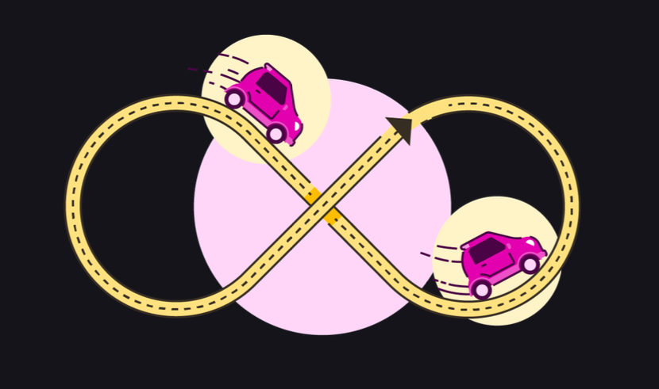

### While 

While được sử dụng để thực hiện lặp đi lặp lại một block cho đến khi **điều kiện sai thì dừng lại**. Còn khi điều kiện đúng, các câu lệnh trong vòng lặp sẽ vẫn tiếp tục được thực thi. 

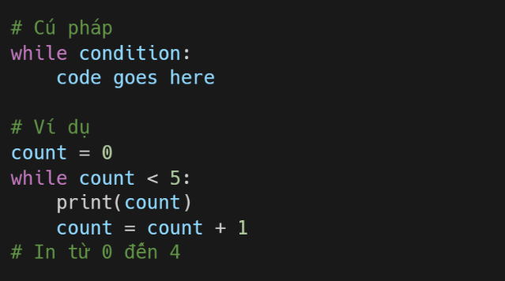

### While else 

Trong vòng lặp while ở trên, điều kiện trở thành sai khi count là 5 nên vòng lặp sẽ dừng lại. Nếu bạn muốn bạn thực thi code khi điều kiện của while sai thì có thể sử dụng **else**

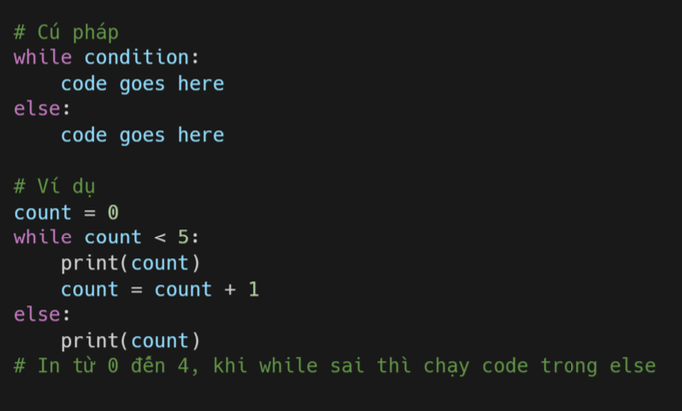

#### Break & Continue 

Bạn có thể sử dụng **break** khi muốn thoát khỏi hoặc dừng vòng lặp. 

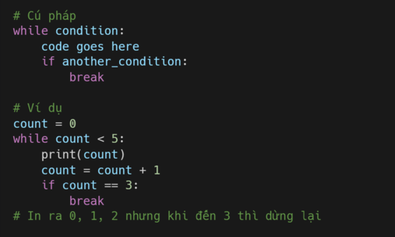

Còn **Continue** dùng để bỏ qua lần lặp hiện tại và chạy tiếp lần lặp tiếp theo. 

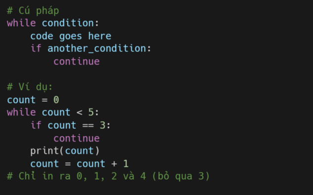

### For

Vòng lặp for được sử dụng để lặp qua một **bộ dữ liệu**, có thể là lits, set, dict, tuple, hoặc chuỗi. 

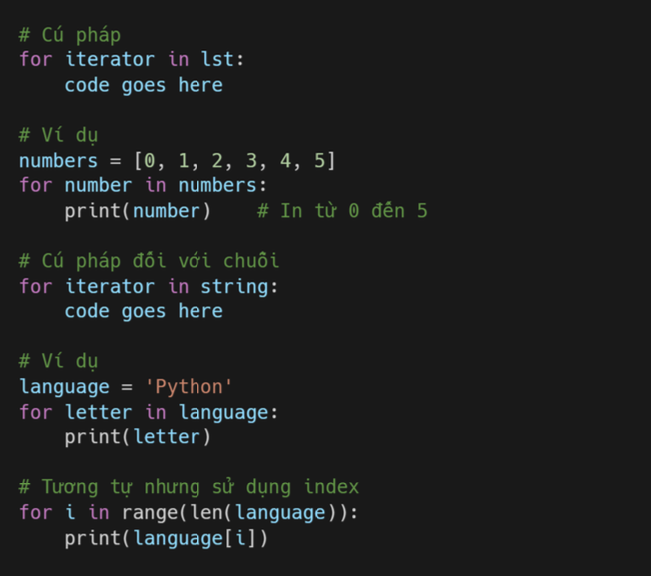

##### Break & Continue 

Tương tự break và continue trong while

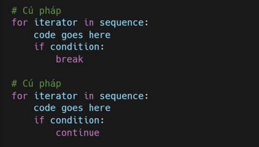

### Phạm vi 

Hàm **range()** dùng để tạo phạm vi. Range có 3 tham số là start, end, step. Mặc định là start là 0 và step là 1. 

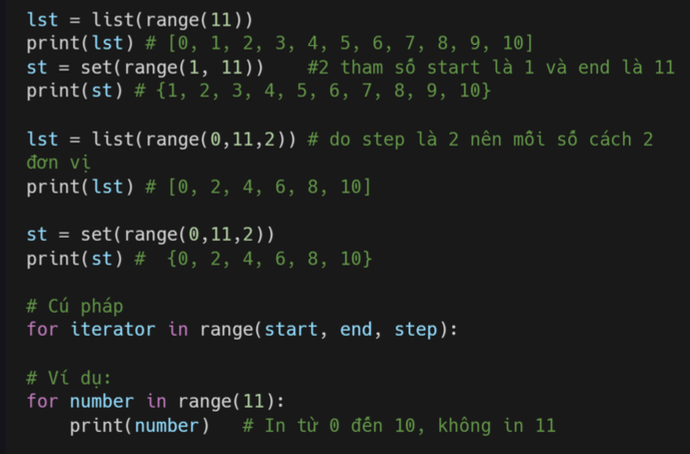

### Vòng lặp nhau 

Bạn có thể viết các lòng lặp nhau, tức là vòng lặp này nằm bên trong vòng lặp khác. 

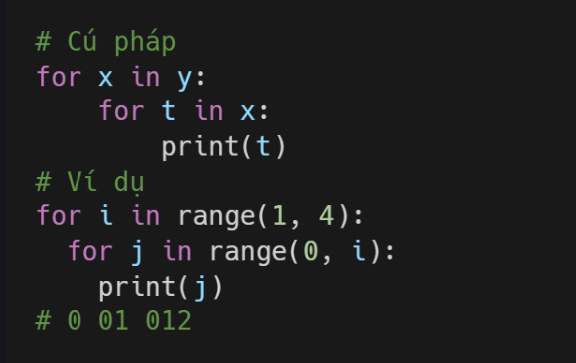

### Pass

Khi viết lệnh if hoặc for, while, nói chung là sau dấu hai chấm thì bạn cần viết thêm code, nó gọi là block code. Nhưng nếu như bạn vẫn chưa thể nghĩ ra code thì có thể sử dụng **pass**. Nó sẽ chạy tiếp chưng trình mà không gây ra lỗi. 

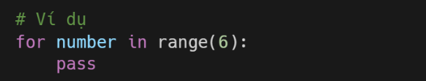

### Bài tập 

Level 1

1. In từ 0 đến 10 bằng vòng lặp for và while.

2. In lại từ 10 đến 0 bằng vòng lặp for và while.

3. Dùng vòng lặp để vẽ hình số 1.

4. Dùng vòng lặp để in bảng cửu chương như hình số 2.

5. Dùng for để lặp từ 0 đến 100 và chỉ in các số chẵn.

6. Làm tương tự câu trên nhưng là in số lẻ.

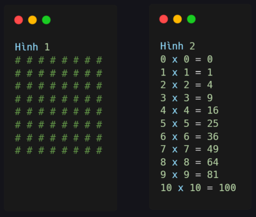

Level 2

1. Sử dụng vòng lặp for để lặp từ 0 đến 100 và in tổng tất cả các số.

2. Sử dụng vòng lặp for để lặp từ 0 đến 100 và in ra tổng của tất cả các số chẵn và tổng của tất cả các số lẻ.

