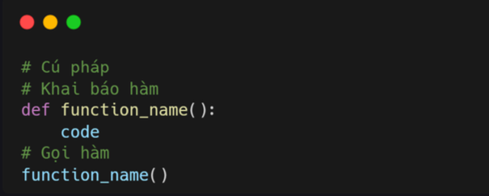
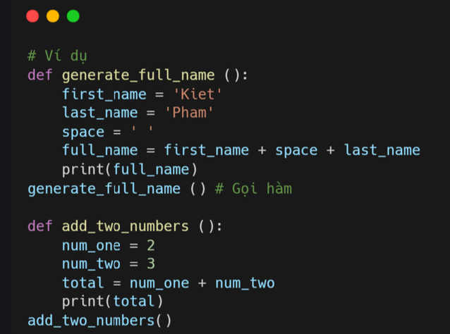
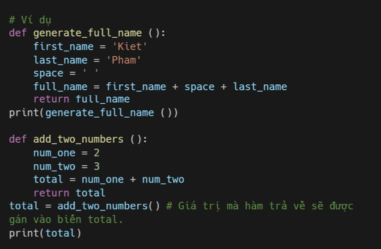
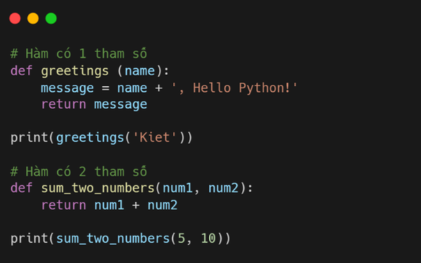
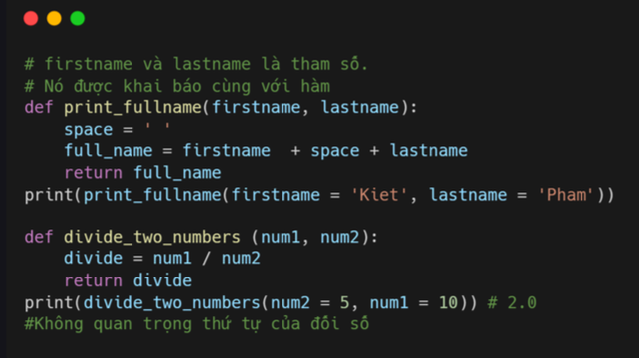
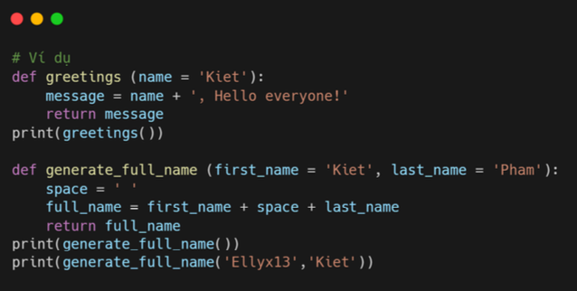
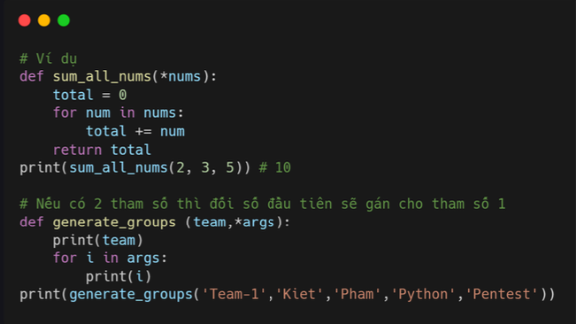
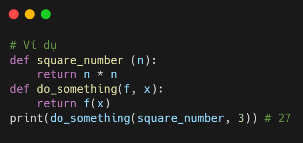

# Hàm 

Hàm là các code có thể **tái sử dụng** hoặc thực hiện một tác vụ nhất định. Thay vì code lại các tác vụ thì bạn chỉ cần cho nó vào hàm và gọi hàm đó để sử dụng bất cứ đâu. Python sử dụng từ khóa **def** để định nghĩa hoặc khai báo hàm. 

### Khai báo và gọi hàm 

Khi bạn tạo hàm thì bạn cũng đã khai báo hàm đó. Bạn có thể gọi hàm để sử dụng nó. Trong Python, hàm có thể có tham số hoặc không có cũng được. 

### Hàm không có tham số 

Như đã nói ở trên bạn có thể khai báo hàm không có tham số (parameters)

### Return giá trị 

Hàm cũng có thể trả về gía trị, nếu hàm không có lệnh **return** thì giá trị của hàm là **None**. Mình sẽ returrn vào ở ví dụ: 

### Hàm có tham số 

Chúng ta có thể truyền **các loại dữ liệu khác nhau** ( số, chuỗi, boolean, lits, tuple, dict hoặc set) làm tham số của hàm. Hàm có thể có nhiều **hơn 1 tham số**. 

### Đối số key value 

Nếu bạn truyền đối số là key và value thì không quan trọng thứ tự đối số đối số là **giá trị truyền vào** khi gọi hàm, còn hàm số là biến được xác định khi khai báo hàm. 

### Tham số mặc định 

Khi sử dụng tham số mặc định, nếu bạn không truyền đối số cho hàm thì hàm sẽ sử dụng gía trị mặc định tham số đó. 

### Nhiều đối số 

Nếu bạn không biết số lượng đối số mà mình truyền vào hàm, thì bạn có thể tạo hàm nhều đối số bằng cách **thêm * trước tên tham số**. 

### Hàm là đối số 

Hàm cũng có thể được truyền như một đối số của hàm khác. 

### Bài tập 

Level 1
1. Viết hàm tính diện tích hình tròn: diện tích = π xrx r.

2. Viết hàm chuyển °C thành °F: °F = (°C x 9/5) + 32.

3. Viết hàm tính phương trình bậc hai: ax² + bx + c = 0.

4. Viết hàm reverse_list dùng để đảo ngược mảng (sử dụng vòng lặp).

Level 2
1. Viết hàm is_prime để kiểm tra xem một số có phải là số nguyên tố hay không.

2. Viết một hàm kiểm tra xem tất cả các phần tử có phải là duy nhất trong list hay không.

3. Viết hàm kiểm tra xem biến được cung cấp có phải là biến python hợp lệ không

