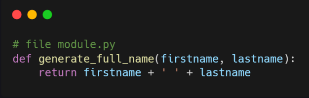
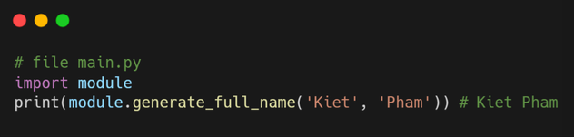
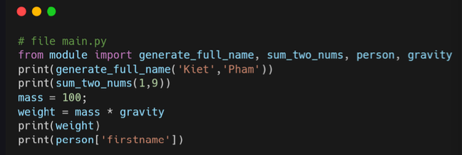
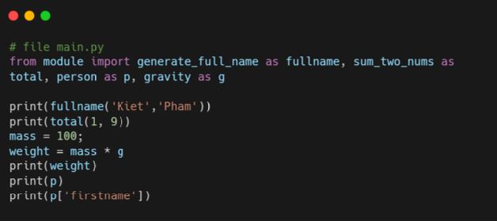
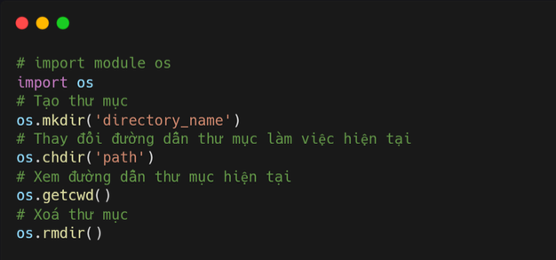
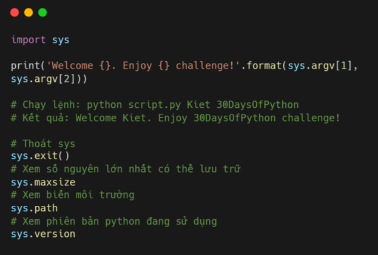
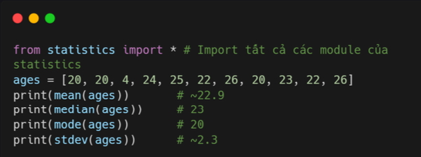
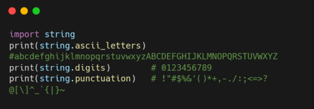
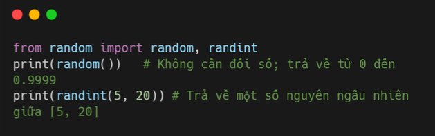
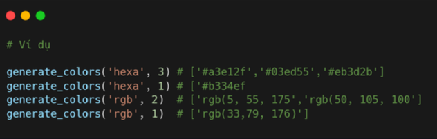

# Module 

### Module 

Module chỉ đơn giản là một **file python**. Trong file đó, chúng ta có thể định nghĩa các biến và chức năng để sử dụng trong một file python khác.  

### Tạo module 

Để tạo một module, bạn chỉ cần viết code và lưu file dưới dạng .py. Tạo một tệp có tên module.py bên trong thư mục dự án. Dưới đây là code mẫu trong file module.py. 

### Import module 

Trong thư mục dự án, mình sẽ tạo thêm file main.py. Để import file module, chúng ta sử dụng từ khóa import + **ten_file_module.py**.

### Import hàm 

Bạn có thể code nhiều hàm trong một file và cũng có thể import nhiều hàm khác nhau. 

### Đổi tên hàm 

Khi import hàm trong file module, bạn có thể đổi tên hàm đó để dễ sử dụng. 

### Module os 

Module os giúp bạn tự động thực hiện nhiều tác vụ của hệ điều hành như tạo, thay đổi thư mục làm việc hiện tại và xóa thư mục, mở và thay đổi nội dung file, **chạy lệnh**, .... 

### Module sys 

Module sys cung cấp các hàm và biến được sử dụng để thao tác với môi trường chạy python. Hàm sys.argv trả về danh sách các đối số được truyền vào khi chạy file python trên terminal. Index 0 luôn là tên tập lệnh (script).

### Module statistics

Module statistic cung cấp cho bạn các hàm thống kê dữ liệu. Các hàm thống kê phổ biến có trong module này gồm: mean, median, mode, stdev...vv 

### Module math 

Module math gồm nhiều phép toán và hằng số như căn bộc 2, giá trị của số pi, ... 

### Module string 

module string là module cực kỳ hữu ích cho nhiều mục đích khác nhau. Ví dụ dưới đây cho thấy một số cách sử dụng module string. 

### Module random 

Module Random giúp bạn tạo các số ngẫu nhiên từ 0 đến 0.999. Nó cũng giúp rất nhiều chức năng khác, nhưng mình sẽ chỉ ví dụ random và randint. 

### Bìa tập 

Level 1
1. Viết một hàm tạo ra một Random_user_id gồm sáu chữ số/ký tự.

2. Viết chương trình tạo số lượng user_id và ký tự do người dùng nhập. Ví dụ nhập 10 5 thì tạo 10 user_id có 5 ký tự.
 
3. Viết hàm tạo ra các mã màu rgb (3 giá trị nằm trong khoảng từ 0 đến 255 mỗi giá trị). Ví dụ: rgb(125,244,255)

Level 2
1. Viết hàm list_of_hexa_colors trả về danh sách số lượng màu thập lục phân (16 ký hiệu, 0-9 và 6 chữ cái a-f).

2. Viết môt hàm list_of_rbg_color trả về danh sách số lượng màu RBG

3. Gộp 2 hàm ở trên thành hàm generate_color có thể tạo ra bất cứ số lượng màu hexa rbg nào. 

