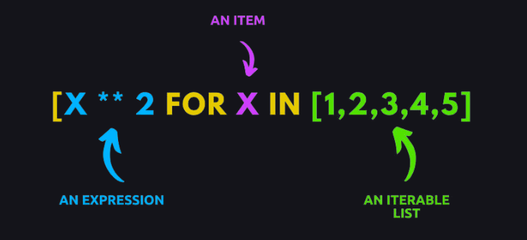
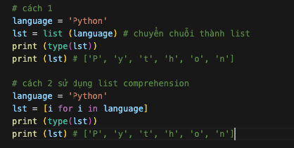
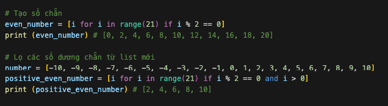
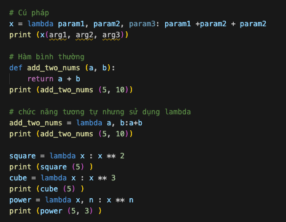
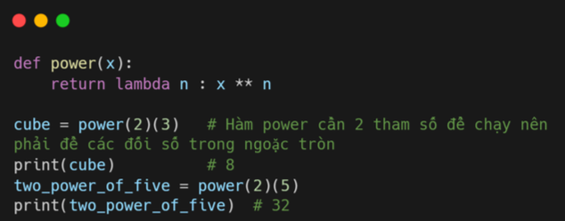
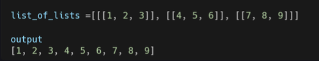
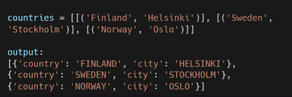

# List Comprehension 

### List Comprehension 

List Comprehension là cách nhanh nhất để tạo lits mới. Phương pháp này chỉ cầm 1 dòng code duy nhất thay vì nhiều dòng như khi dùng for. 

## Ví dụ 1

Chẳng hạn, nếu bạn muốn chuyển một chuỗi thành một danh sách các ký tự thì bạn có thể thử thách dưới đây. 

### Kết hợp với if 

Bạn cũng có thể kết hợp list comprehension với if như ví dụ dưới. 

## Hàm lambada 

Hàm lambada là một **hàm ẩn danh** không có tên. Các hàm bình thường sẽ được định nghãi bằng def thì hàm ấn danh được định nghĩa bằng lambada. 

### Lambda trong hàm 

Nếu bạn muốn sử dụng hàm lambda bên trong một hàm khác thì có thể xem ví dụ dưới đây. 

## Bài tập 

1. Lọc các số âm và số 0 trong list dưới bằng cách sử dụng List comprehesion. number = [-4, -3, -2, -1, 0, 2, 4, 5, 6, 7]

2. Làm phẳng lits dưới thành list một chiều 

3. Chuyển list dứoi thành dictionary 

