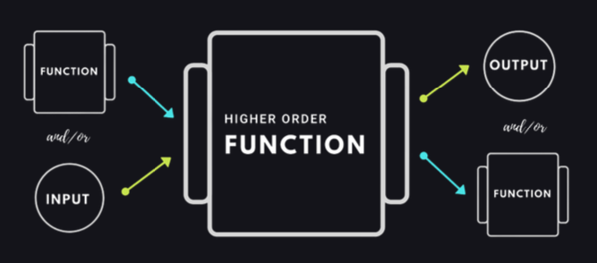
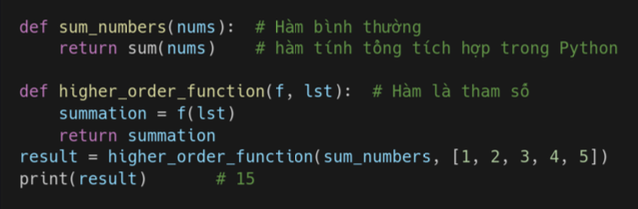
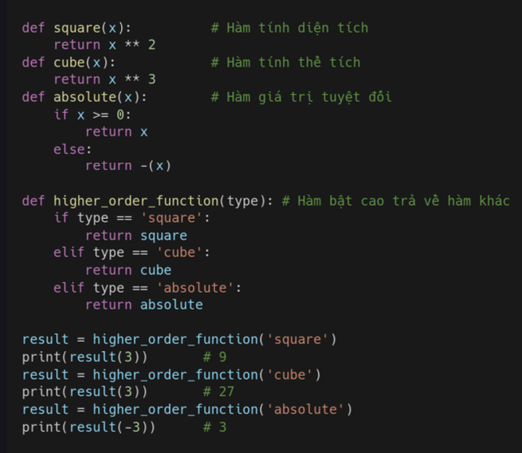
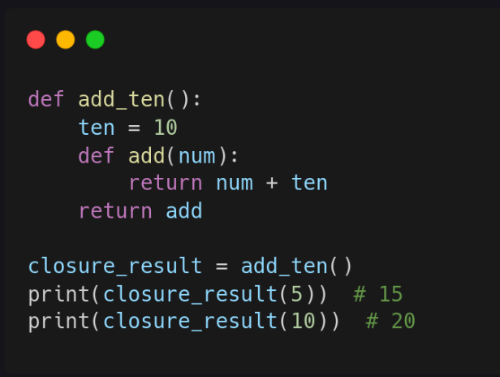
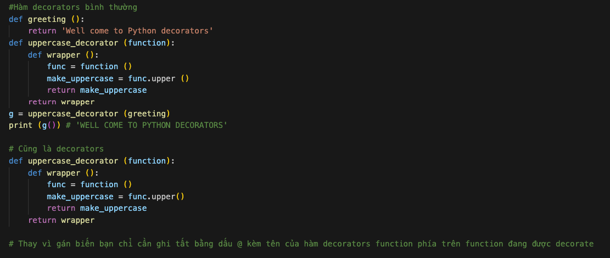
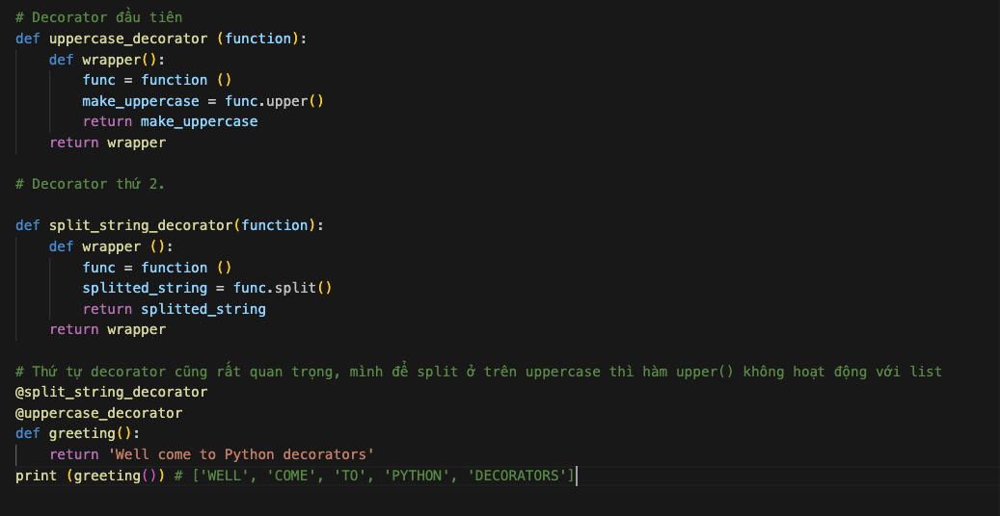
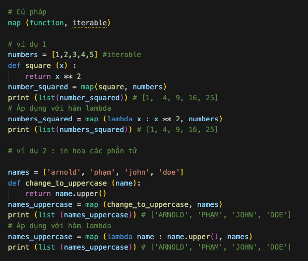
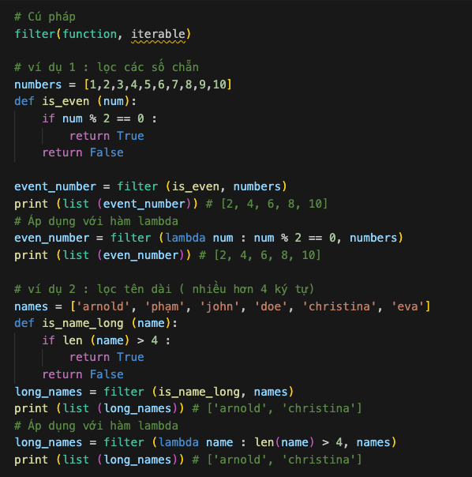
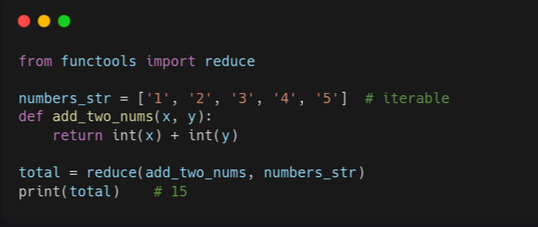

# Hàm bậc cao 

### Hàm bậc cao 

Hàm bậc cao (hight order function) là hàm có tham số là hàm khác, hoặc trả về kết quả của hàm khác, có thể sửa đổi và gán cho một biến. 

### Hàm là tham số 

Như ví dụ bên dưới, mình chuyển hàm sum_numbers là đối số của hàm hight_order_function, khi vào hàm thì hàm sum_numbers được tái định nghĩa lại thành biến f. Biến này có chức năng tương tự như hàm sum_numbers. 

### Return hàm 

Hàm bậc cao cũng có thể trả về 1 hàm khác, tùy thuộc vào tham số truyền vào như ví dụ dưới.

### Hàm lồng nhau 

Python cho phép hàm lồng nhau truy cập phạm vi bên trong hàm tạo ra nó. Đây gọi là **Closure**. Trong python, hàm lồng nhau được tạo bằng cách lồng một hàm bên trong một hàm khác rồi trả về hàm lồng nhau đó. Xem ví dụ dưới cho dễ hiểu. 

### Decorators 

Decorators là một design pattern trong Python cho phép ngươig dùng thêm hàm mới vào một object mà không sửa đổi cấu trúc của nó. Decorator thường được gọi trước khi định nghĩa hàm bạn muốn decorator. 

### Áp dụng nhiểu decorator cho hàm 

### Các hàm bậc cao tích hợp 

Một số hàm bậc cao tích hợp sãn mà mình sẽ giứoi thiệu gồm map(), filter và reduce. Hàm lambada sẽ có thể được truyền dưới dạng tham số và trường hợp sử dụng tốt nhất của lambada là trong các hàm như map(), filter và reduce.

### Hàm map 

Hàm map() duyệt tất cả các phần tử của iterable qua function và trả về một lits kết quả sau khi thực thi. 

### Hàm Filter 

Hàm filter() gọi hàm đã chỉ định trả về giá trị boolean cho từng phần tử của bộ dữ liệu. Nó lọc các phần tử thỏa mãn tiêu chí lọc. 

### Hàm Reduce
Hàm reduce() được định nghĩa trong module funcools. Giống như map và filter, nó có hai tham số, function và iterable. Tuy nhiên, nó không trả về danh sách mà là một gía trị duy nhất. 

### Bài tập 

Level 1:
1. Giải thích sự khác biệt giữa map, filter và reduce.

2. Giải thích sự khác biệt giữa hàm bậc cao, hàm lồng nhau và decorator.

Level 2:
1. Tạo một hàm trả về một từ điển, trong đó các khóa là chữ cái bắt đầu của các quốc gia và giá trị là số tên quốc gia bắt đầu bằng chữ cái đó.
2. Sử dụng filter để lọc các quốc gia có từ 'land'.
3. Sử dụng map để thay đổi từng tên thành chữ hoa trong danh sách names.
4. Sử dụng reduce để tính tổng tất cả các số trong danh sách numbers.
