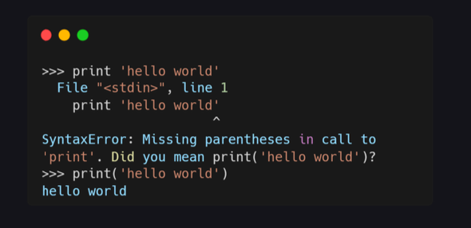
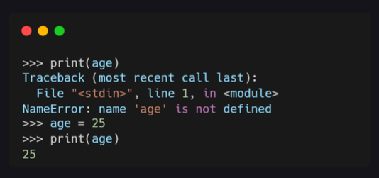
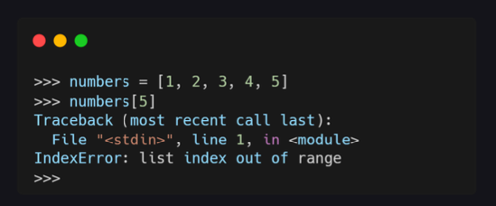
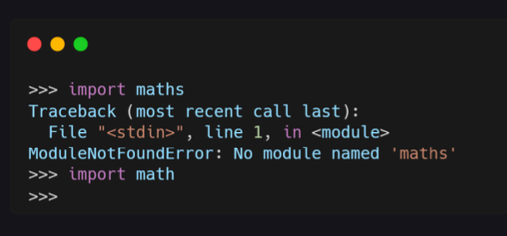
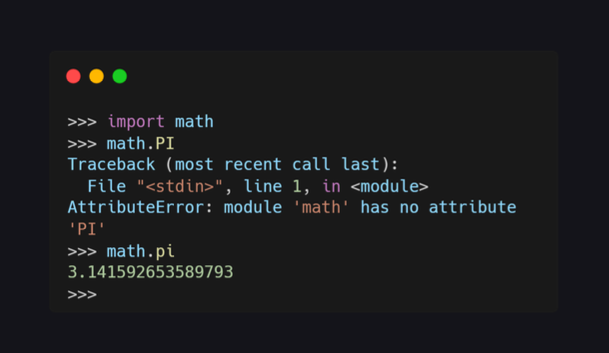
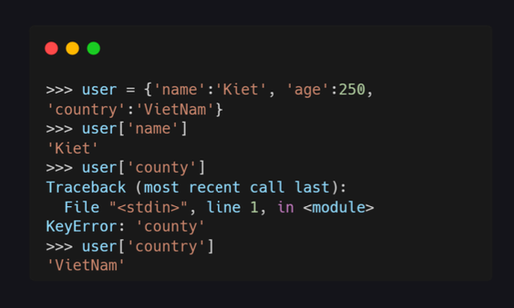
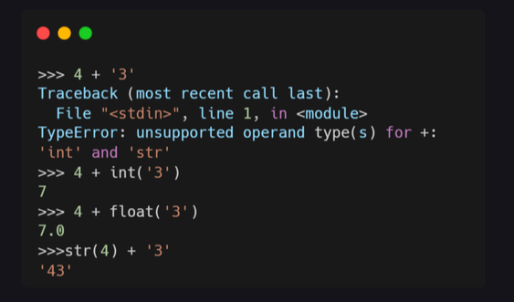
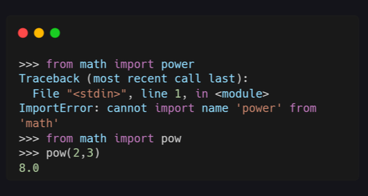
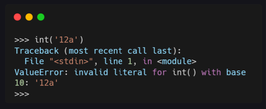

# Các loại lỗi 

### Type Errors

Khi viết code, bạn sẽ thường mắc phải lỗi đánh máy hoặc một số lỗi phổ biến khác. Nêú Code bị lỗi, compiler của python sẽ hiển thị thông báo lỗi. Hiểu được những lỗi này sẽ giúp bạn gỡ lỗi nhanh hơn nhé. Trước khi vào bài thì bạn cần truy cập shell python bằng cách mở terminal và gõ python. 

### SyntaxError 

Lỗi đầu tiên mình muốn giới thiệu là **lỗi cú pháp (SyntaxErros)**. Mình đã mắc phải lỗi cú pháp vì mình quên đặt chuỗi trong dấu ngoặc đơn và Python cũng đã đề xuất giải pháp sửa lỗi. 

### NameErros 

Như bạn đã thấy từ thông báo lỗi, biến age chưa được định nghĩa. Mình gặp lỗi này vì mình chưa định nghĩa biến age mà đã in biến đó ra màn hình. Lỗi này được gọi là **NameError**.

### IndexError

**IndexError** là lỗi truy cập ngoài phạm vi chỉ mục. Ví dụ như ảnh bên dưới, mảng numbers chỉ có 5 phần tử và chỉ mục (index) từ 0 đến 4, nên khi mình truy cập chỉ mục 5 thì sẽ bị lỗi. 

### ModuleNotFoundErros 

**ModuleNotFoundErros** là lỗi import sai module. Nguyên nhân là do có thể bạn nhập sai tên hoặc chưa cài đặt module đó. Như trong ví dụ dưới, mình đã nhập sai tên của module math và maths.

### AttributeErros 

**AttributeErros** thường là lỗi do bạn gọi các chức năng không tồn tại trong module. Như cí dụ dứoi, mình đã gọi sai hàm PI, đúng phải là pi. 

### KeyError
 
**KeyError** lá lỗi truy cập vào key không tồn tại trong ditionary. Như ví dụ dưới, key county không có trong dict users, đúng phải là cuntry.

### TypeErros 

**TypeErros** là những lỗi liên quan đến thao tác giữa 2 kiểu dữ liệu, thường là string và int. Như ví dụ dưới, TypeError xuất hiện vì mình cộng số với chuỗi. Giải pháp chuyển 1 trong 2 về cùng một kiểu dữ liệu. 
git

### ImportError

**ImportError** là lỗi import sai tên hàm trong module. Như ví dụ dưới, không có hàm power mà chỉ có hàm pow trong module math. 

### ValuError

**ValuError** Là lỗi truyền đúng kiểu dữ liệu vào hàm nhưng giá trị của dữ liệu lại không thích hợp. Như ví dụ dưới, bạn không thể chuyển chuỗi thành só vì trong chuỗi đó có chứ a. 

### ZeroDivisionError

**ZeroDivisionError** là lỗi không thể chia cho số 0. Thường là khi bạn chia một số nguyên hoặc float nào đó cho số 0. 

