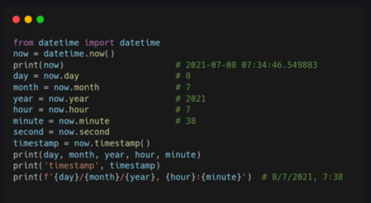
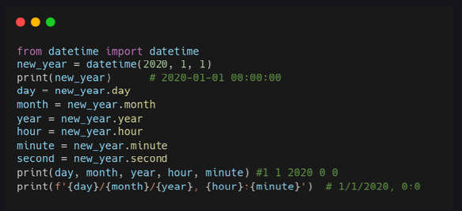
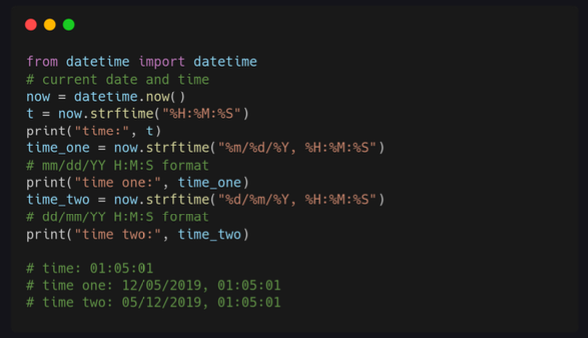
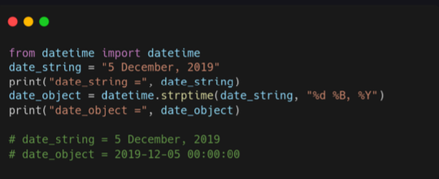
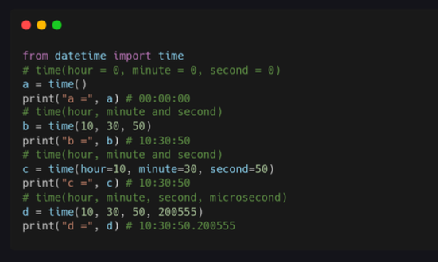
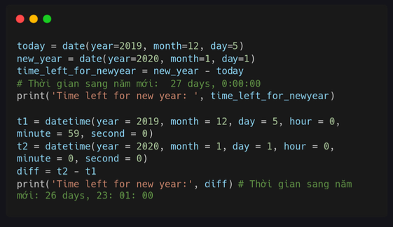
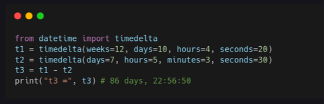

# Day 16: Date Time 

### Date time
Với python, bạn có thể dễ dàng lấy ngày giờ hiện tại của hệ thống. Trong bài này, mình sẽ giới thiệu một số phương thúc thay đổi phổ biến khi làm việc với Date Time. 

### Thông tin ngày giờ
**Timestamp** là số giây trôi qua kể từ ngày 1 tháng 1 năm 1970 UTC. 



### Định dạng ngày 



Hoặc bạn có thể định dạng ngày bằng cách sử dụng **strftime**.



### Ký hiệu strftime

Dưới đây là **các ký hiệu (format codes) của `strftime`** thường dùng trong Python (và tương tự trong C, Linux):

## 📅 Ngày (Date)

| Ký hiệu | Ý nghĩa                                | Ví dụ   |
| ------- | -------------------------------------- | ------- |
| `%Y`    | Năm đầy đủ                             | 2026    |
| `%y`    | 2 chữ số cuối của năm                  | 26      |
| `%m`    | Tháng (01–12)                          | 01      |
| `%B`    | Tên tháng đầy đủ                       | January |
| `%b`    | Tên tháng viết tắt                     | Jan     |
| `%d`    | Ngày trong tháng (01–31)               | 09      |
| `%j`    | Ngày thứ bao nhiêu trong năm (001–366) | 013     |

## 🕒 Thời gian (Time)

| Ký hiệu | Ý nghĩa      | Ví dụ |
| ------- | ------------ | ----- |
| `%H`    | Giờ (00–23)  | 14    |
| `%I`    | Giờ (01–12)  | 02    |
| `%M`    | Phút (00–59) | 30    |
| `%S`    | Giây (00–59) | 45    |
| `%p`    | AM / PM      | PM    |

## 📆 Thứ & Tuần

| Ký hiệu | Ý nghĩa                           | Ví dụ  |
| ------- | --------------------------------- | ------ |
| `%A`    | Tên thứ đầy đủ                    | Monday |
| `%a`    | Tên thứ viết tắt                  | Mon    |
| `%w`    | Thứ (0=Chủ nhật)                  | 1      |
| `%W`    | Số tuần trong năm (bắt đầu Thứ 2) | 05     |
| `%U`    | Số tuần trong năm (bắt đầu CN)    | 05     |

## 🌍 Khác

| Ký hiệu | Ý nghĩa           | Ví dụ                   |
| ------- | ----------------- | ----------------------- |
| `%c`    | Ngày & giờ đầy đủ | Mon Jan 9 14:30:45 2026 |
| `%x`    | Ngày theo locale  | 01/09/26                |
| `%X`    | Giờ theo locale   | 14:30:45                |
| `%%`    | Dấu %             | %                       |

## 🔹 Ví dụ Python

```python
from datetime import datetime

now = datetime.now()
print(now.strftime("%d/%m/%Y %H:%M:%S"))
```

👉 Kết quả: `09/01/2026 14:30:45`

Nếu bạn dùng **Python**, **Linux**, hay **Excel** (TEXT format) mình có thể chỉ ra điểm khác nhau cụ thể 👍

### Chuỗi strptime 

Bạn có thể chuyển một chuỗi thời gian sang định dạng datetimne bằng cách sử dụng strptime. 



### Ngày datetime 


### Object time 



### Tính toán datetime 



### Sử dụng timedelate 



### Bài tập 

1. Lấy ngày, tháng, năm, giừo, phút và timestamp hiện taị từ module datetime 
2. Định dạng ngày hiện tại bằng định dạng sau: "%m/%d/%Y, %H:%M:%S"
3. Chuyển chuỗi "14 June, 2023" sang datetime.
4. Tính thời gian từ giờ đến năm mới còn bao nhiêu lâu nữa 
5. Tính thời gian từ ngày 1 tháng 1 năm 1970 đến hiện tại. 
