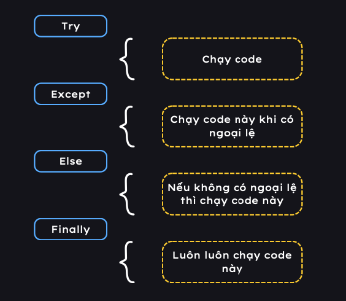
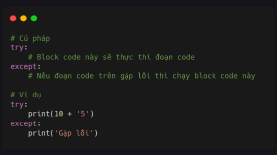
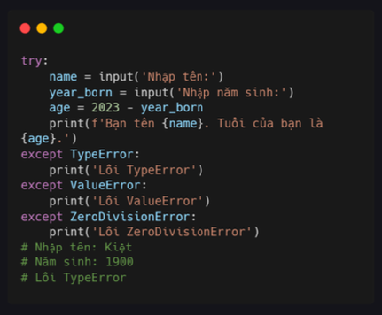
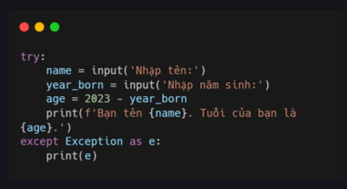
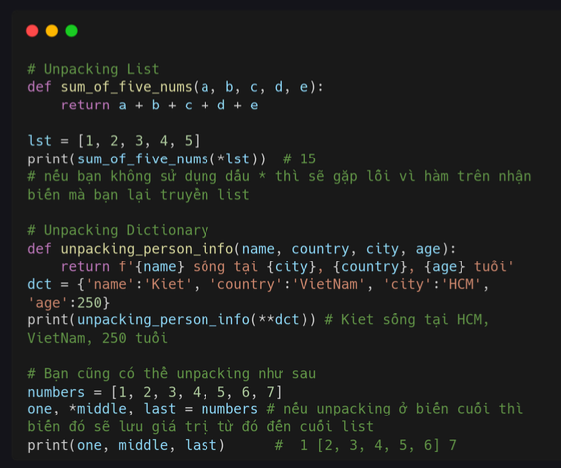
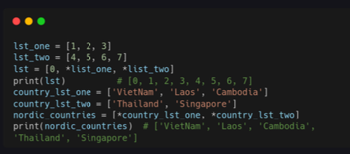
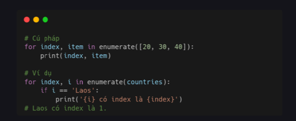
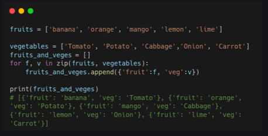
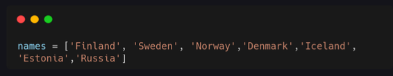

# Day 17 Ngoại lệ 

### Ngoại lệ 

Python sử dụng **try và except** để xử lý lỗi hoặc ngoại lệ. Nguyên nhân của lỗi thường nằm bên ngoài chương trình, ví dụ như sai input, tên file sai, không tìm thấy file,...Bạn có thể sử dụng try except để xử lý các lỗi thường gặp mà chúng ta đã học ở bài trước. 

Cú pháp xử lý ngoại lệ bằng try và except rất đơn giản. Như trong ví dụ dưới, khi cộng số 10 với chuỗi '5' sẽ gặp lỗi nên python sẽ chạy đoạn code trong except. 

### Các loại lỗi khác 

Mặc dù chúng ta đã bắt được ngoại lệ nhưng lại không biết đó là lỗi gì nếu code trở nên phức tạp hơn như ví dụ dưới. May mắn là except cũng có thể xử lý nhiều loại lỗi khác nhau. 

Đoạn code trên cũng có thể được rút ngắn thành đoạn code dưới. Bạn có thể biết lỗi ở đâu và sửa như thế nào không?

### Unpacking 

Unpacking Agrgs là giải nén các giá trị từ một bộ dữ liệu nào đó như lits, tuple... Chúng ta cũng có 2 toán tử là * cho bộ dữ liệu và ** cho dictionary 

### Spreading 

Tương tự như JavaScript, python cũng có Spreading. Bạn có thể xem ví dụ dưới để rõ hơn. 

### Enumerate

Nếu bạn cần lấy index trong list, thì bạn có thể sử dụng **enumerate**

### Zip

Bạn cũng có thể kết hợp 2 hoặc nhiều list khi duyệt bằng **zip**.

### Bài tập

1. Giải nén năm quốc gia đầu tiên và lưu vào biến
nordic_countries, lưu Estonia vào es và Russia vào ru.

