# Day 18: Regex

### Regex

Regular Expression hoặc Regex là một chuỗi văn bản đặc biệt giúp **tìm mẫu (pattern)** trong dữ liệu. Regex có thể được sử dụng để kiểm tra tính hợp lệ của email hoặc sđt. Để sử dụng Regex trong python, bạn có thể import module **re**. 

### Module re

Bạn có thể sử dụng Regex bằng cách import module re bằng cú pháp dưới. Module này có rất nhiều method khác nhau nhưng trong bài này chúng ta sẽ tìm hiểu về 5 method chính là **match()**, **search**, **findall**, **split** và **sub**.

### Match 

Method **match()** chỉ tìm kiếm ở đầu dòng đầu tiên của chuỗi và trả về các đối tượng phù hợp nếu tìm thấy, ngược lại nếu không tìm thấy thì sẽ trả về mone. 

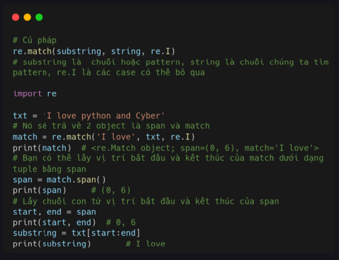

### Search 

Method **search()** sẽ trả về vị trí bắt đầu và kết thúc của chuỗi con. Nếu không tìm thấy thì sẽ trả về None. Match chỉ tìm kiếm ở đầu chuỗi hoặc đầu dòng đầu tiên của chuỗi. Còn search sẽ **tìm toàn bộ chuỗi** ngay cả khi chuỗi đó có nhiều dòng. 

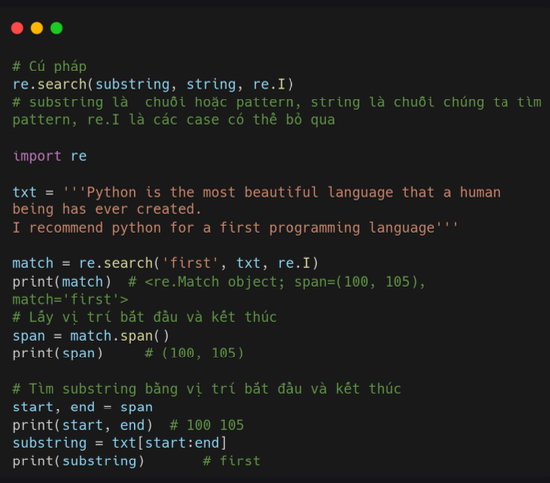

### Findall 

Có một method tương tự như 2 method trên nhưng tốt hơn là **findall**. Mothod này kiểm tra pattern trong toàn bộ chuỗi và trả về tất cả các kết quả dưới dạng list. 

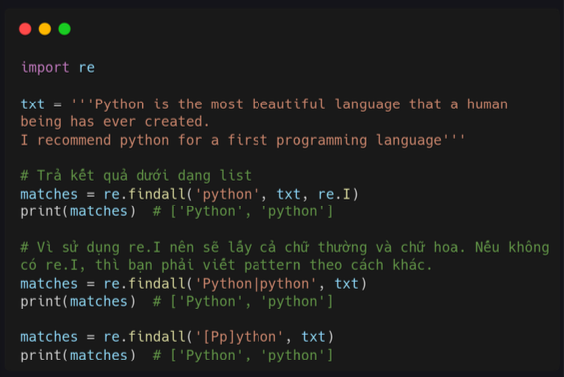

### Sub 

Mothod **Sub** sẽ thay thế những pattern tìm được thành chuỗi khác. Bạn có thể xem ví dụ dưới để rõ.

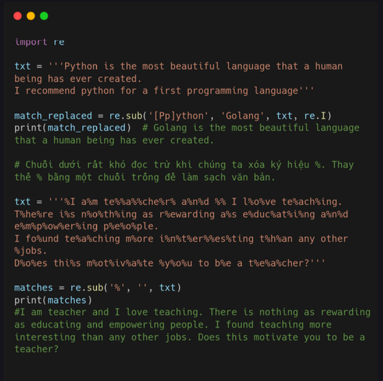

### Split 

Method **split** sẽ tách chuỗi chính theo pattern thành những chuối con và lưu và lits. 

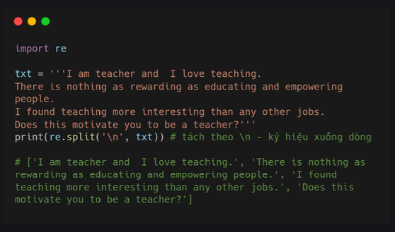

### RegEX Pattern 

Khi viết pattern, bạn nên sử dụng ký tự r trước cặp dấu nháy đơn. Ví dụ dưới sẽ tìm từ apple bằng chữ thường, và các trường hợp khác nữa như chữ hoa hoặc cả hai. 

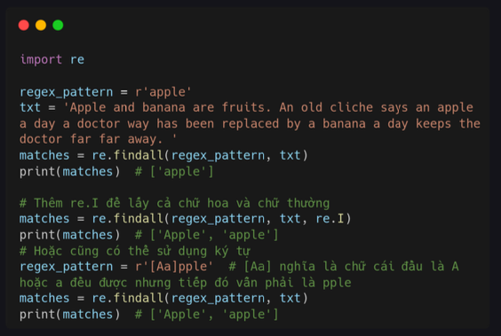

### Bảng Pattern 

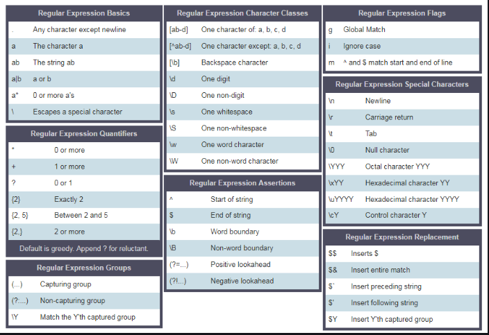

### Dấu ngoặc vuông 

Bạn có thể xem ví dụ tìm chữ Apple thường và hóa hoặc tìm thêm banana bên dưới. 

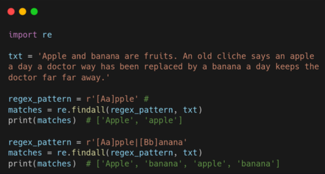

### Dấu chéo ngược 

Dấu chéo ngược (\) tượng trưng cho nhiều ký tự đặc biệt như \d là số \w là ký tự. 

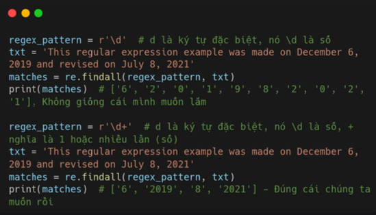

### Dấu chấm 

Trong ví dụ dưới, dấu ngoặc vuông có nghĩa là a và . có nghĩa là bất kỳ ký tự nào ngoại trừ ký tự dòng dưới (\n). 

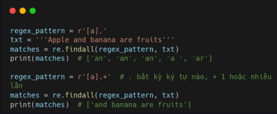

### Dấu hoa thị 

Dấu hoa thị *, nghĩa là không hoặc nhiều lần. Pattern này có thể không xảy ra hoặc nó có thể xảy ra nhiều lần. 

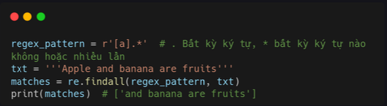

### Dấu chấm hỏi 

Dấu chấm hỏi ?, nghĩa là không hoặc một lần. Pattern này có thể không xảy ra hoặc nó có thể xảy ra một lần.  

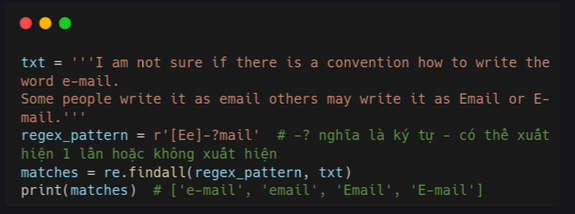

### Độ dài lý tự 

Chúng ta có thể chỉ định độ dài của chuỗi con mà chúng ta đang tìm kiếm trong văn bản bằng cách sử dụng dấu ngoặc nhọn. 

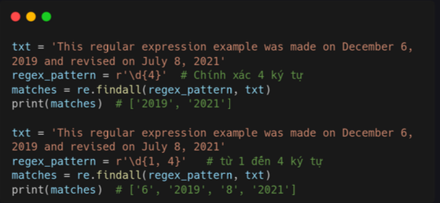

### Dấu mũ 

Dấu mũ ^ dùng để kiểm tra ký tự đầu tiên của dòng có phù hợp với pattern không. 

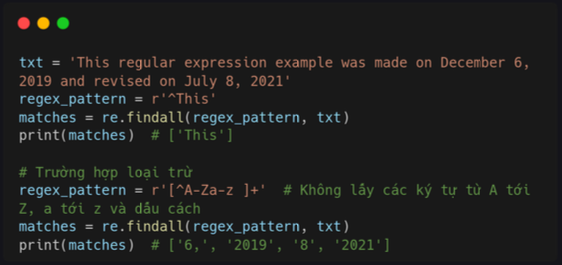

### Bài tập 

1. Thống kê số lần các từ xuất hiện trong đoạn sauL:

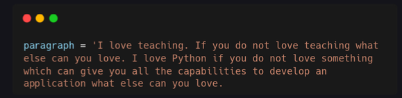

2. Kiểm tra một chuỗi có phải là một biến hợp lệ hay không 

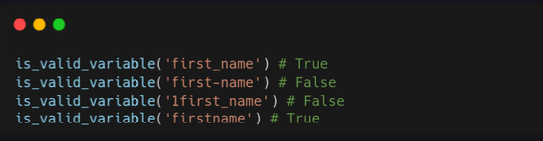

3. Làm sạch chuỗi dưới và tìm 3 từ xuất hiện nhiều nhất. 

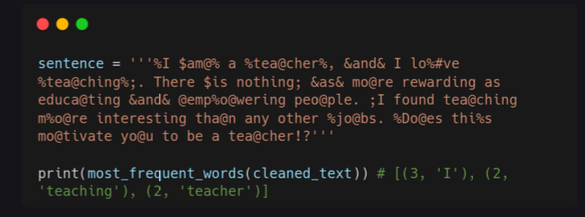
