# Day 19 Xử lý file 

### Xử lý file 

Xử lý file cho phép chúng ta tạo, đọc, cập nhật và xóa tệp. Trong python để xử lý dữ liệu, chúng ta có thể sử dụng hàm tích hợp oprn(). 

### Cú pháp

Hàm open() có 2 đối số là tên file và mode. Có tổng cộng 6 chế độ khác nhau để đọc, ghi và cập nhật file như: 
- "r" - Read (giá trị mặc định): Mở file để đọc, nó sẽ báo lỗi nếu file không tồn tại. 
- "a"- Append: Mở file để ghi thêm, tạo file nếu file chưa tồn tại
- "w" - Write: Mở file để ghi, tạo file nêú file chưa tồn tại.
- "x" - Creat: Tạo file đã chỉ định, trả về lỗi nếu file tồn tại 
- "t" - Text (giá trị mặc định): Chế độ văn bản 
- "b" - Binary: Chế độ nhị phân (ví dụ: hình ảnh)

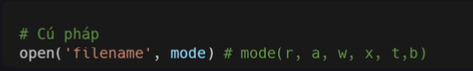

### Đọc file 

Chế độ mặc định của hàm open() là đọc, nên không cần phải thêm mode 'r' hoặc 'rt'. Mình tạo và lưu file có tên là read_file_example.txt trong thư mục files. File mở có các cách đọc khác nhau: **read()**, **readline**, **readlines**. Lưu ý là file phải được đóng bằng hàm **close()**.

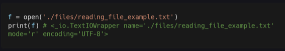

### Read() 

Method **red()**, đọc toàn bộ văn bản dưới dạng chuỗi. Nếu bạn muốn giới hạn số lượng ký tự muốn đọc, bạn có thể thêm giá trị int cho method **red(number)**.

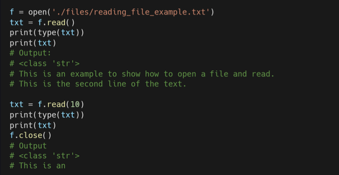

### Readline() 

Method **readline()**, chỉ đọc dòng đầu tiên của file. 

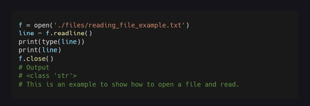

### Readlines()

Method **Readlines()**, đọc tất cả các dòng văn bản trong filr và đưa và lits. 

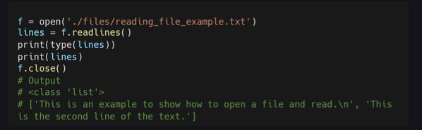

Bạn cũng có thể lấy tất cả các dòng dưới dạng lits và sử dụng splitlines():

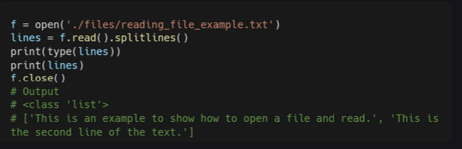

### Tự động đóng File 

Bạn nên đóng file lại sau khi mở file, nhưng hầu như ai cũng quên đóng file. Vậy nên bạn có thể mở file bằng **with** để nó tự động đóng file. 

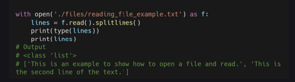

### Ghi và cập nhật 

Để ghi và cập nhật vào file đã có, bạn phải thêm các chế độ dưới làm tham số cho hàm open().
- "a" - Append - sẽ ghi tiếp dữ liệu vào cuối file, nếu chưa có file chỉ tạo file mới. 
- "w" - Write - Ghi đè dữ liệu mới lên tất cả dữ liệu của file, nếu chưa có file thì tạo file mới. 

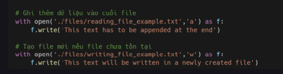

### Xóa file 

Chúng ta đã tìm hiểu cách tạo và xóa thư mục bằng module os trong các bài trước. Nhưng cho bạn nào đã quên thì khi muốn xóa file, bạn có thể sử dụng module os.

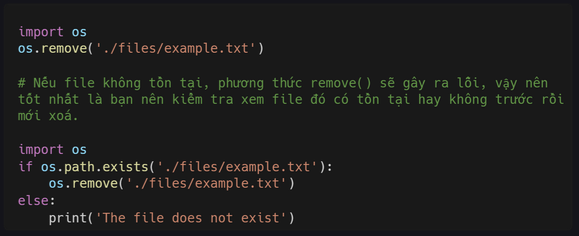

### Các loại file 

Nãy giờ chũng ta đang làm việc với file txt. Nhưng trong thực tế, bạn sẽ phải làm việc với nhiều loại file khác như Json, CSV, Xslsx và xml.

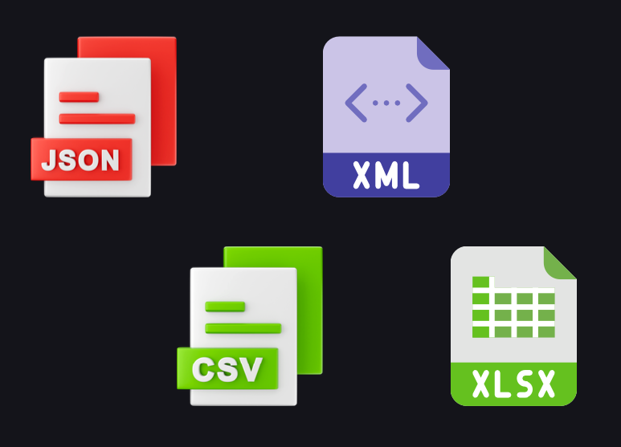

### File Json 

**Json** là viết tắt của JavaScript Object Notation. Trên thực tế, nó là một đối tượng được xâu chuỗi JavaScript hoặc tương tự như Dictionary của Python. 

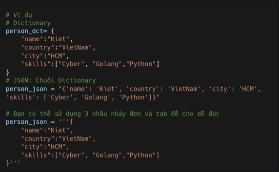

### Chuyến Json sang Dictionary 

Để chuyển JSON thành Dictionary, bạn cần import module json và sử dụng method **loads()**.

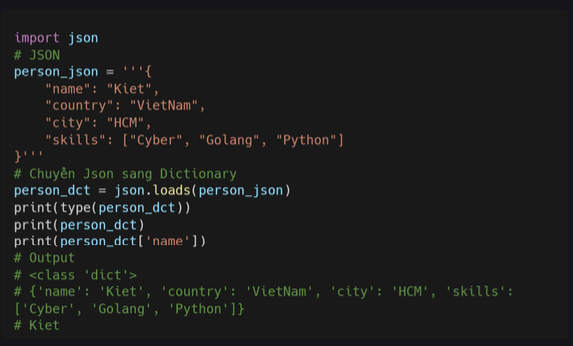

### Chuyển Dictionary sang JSON 

Để chuyển Dictionary thành Json, bạn có thể sử dụng method **dumps()** trong module json. 

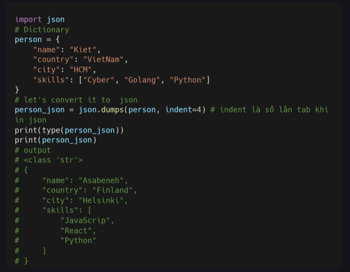

### Lưu File Json 

Bạn có thể lưu dữ liệu của mình dưới dạng file json bằng cách sử dụng method **json.dump()**, nó cần các tham số như dictionary, file_output, ensure_ascii và indent. 

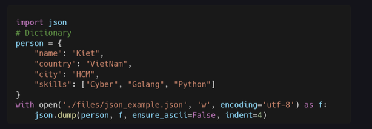

### File CSV 

CSV là viết tắt của Comma Saparated Values. CSV là một định dạng file đơn giản được sử dụng để lưu trữ dữ liệu dạng bảng, chẳng hạn như **bảng tính hoặc cơ sở dữ liệu**. CSV là một định dạng dữ liệu rất phổ biến trong khoa học dữ liệu. 

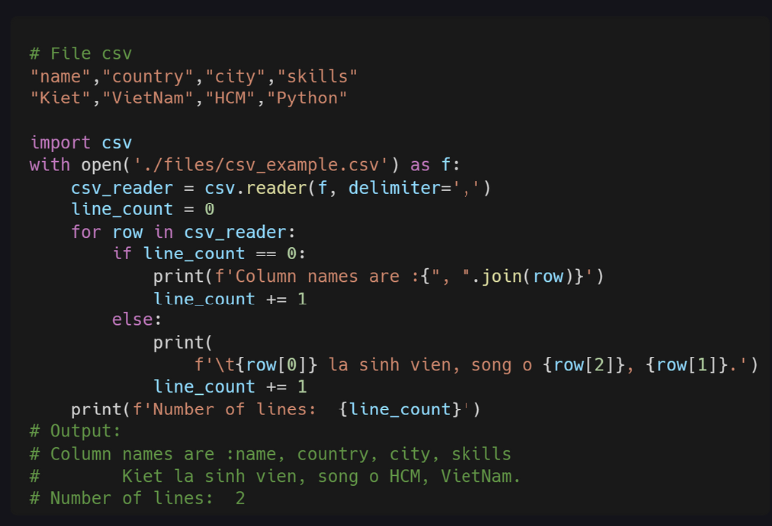

### File xlsx

Để đọc file excel chúng ta cần cài package **xlrd**. Mình sẽ nói sâu hơn về phần này khi tới bài cài package bằng pip. 

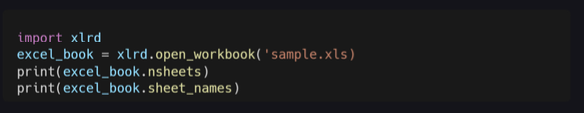

### File xml 

XML là một dịnh dạng dữ liệu có cấu trúc giống như HTML. Trong XML, các thẻ không được xác định trước. Dòng đầu tiên là khai báo XML. Thẻ person là gốc của XML. Người có thuộc tính gender. 

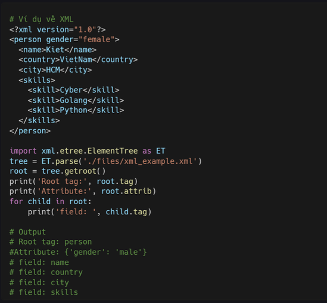

### Bài tập 

1. Viết hàm đếm số dòng, số chữ trong file.

2. So sánh sự giống nhau của 2 file văn bản. Nó chỉ có 2 trạng thái là giống nhau hoàn toàn và không.

3. Tạo 1 dictionary giới thiệu bản thân mình và chuyển nó sang json rồi lưu nó dưới dạng me.json

4. Lấy 1 file bất kỳ, lập danh sách top 3 từ được dùng nhiều nhất. Đếm số dòng có từ đó. Tìm dòng có nhiều từ đó nhất.

