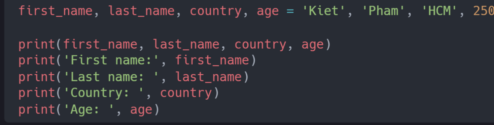

## Hàm built-in
Trong Python có rất nhiều hàm tích hợp sẵn (built-in). Các hàm này được cài đặt sẵn trong python, vậy nên bạn có thể sử dụng các hàm này mà không cần phải tải bất kỳ thư viện nào cả. Một số hàm tích hợp sẵn được sử dụng phổ biến trong python gồm print(), len(), type(), int(),float(), str(), input(), list(), dict(), min(), max(), sum(),sorted(), open(), file(), help() và dir().

## Biến 
Biến lưu trữ dữ liệu trong bộ nhớ máy tính. Biến được sử dụng trong nhiều ngôn ngữ lập trình. Bạn nên đặt tên biến để ghi nhớ và hiểu ý nghĩa của biến đó. Biến trỏ đến một địa chỉ trong bộ nhớ, nơi dữ liệu được lưu trữ. Không được phép đánh số ở đầu, ký tự đặc biệt, gạch nối khi đặt tên biến. Biến có thể có một tên ký tự ngắn như (x, y z    ) nhưng khuyến khích bạn đặt tển có ý nghĩa như (name, age, ...)

**Quy tắc đặt tên biến**
- Tên biến phải bắt đầu bằng một chữ cái hoặc một ký tự gạch dưới. 
- Tên biến không được bắt đùa bằng số
- Tên biến chỉ có thể chứa các ký tự chữ và số hoặc dấu gạch dưới (Az, 0-9 và _) 
- Tên biến phân biệt chữ hoa và chữ thường ( firstnam, Firstname, FirstName and FIRSTNAME)

**Quy ước đặt tên biến**
Trong khi code các dự án, bạn và team của mình sẽ liên tục đặt tên cho file và biến, hàm và các thứ khác trong code và tài liệu. Vậy nên, team phải thống nhất chung một quy tắc đặt tên biến (name convention). nếu không sẽ rất khó trong việc review code. 

**Khai báo biến** 
 Khi chúng ta gán một kiểu dữ liệu nào đó cho một biến, nó được gọi là khái báo biến. Ví dụ bên dưới, tên được gán cho một biến fist_name. Dấu "=" là toán tử gán. Gán có nghãi là lưu trữ/ lưu lại dữ liệu trong biến đó. Dấu "=" trong python không phải là đẳng thức như trong toán học 
 
 

Bạn cũng có thể khai báo nhiều biến trên cùng 1 dòng nhưu ví dụ sau. 

Nhận đầu vào của người dùng bằng hàm input(). Ví dụ như bạn muốn lấy dữ liệu mà người dùng đăng nhập từ bàn phím và in ra màn hình. 

**Kiểm tra dữ liệu**

Các bạn có thể sử dụng hàm tpye() để kiểm tra kiểu dữ liệu trong python. 

**Ép kiểu dữ liệu**

Chuyển đổi một kiểu dữ liệu này sang kiểu dữ liệu khác được gọi là ép kiểu dữ liệu. Chúng ta sử dụng int(), float(), str(), list, set,. Khi thực hiện các phép tính số học, trước tiên các chuỗi số phải được chuyển đổi thành int hoặc float nếu không  python sẽ báo lỗi. Nếu chúng ta nối 1 số với một chuỗi, thì trước tiên số đó phải được chuyển đổi thành mỗi chuỗi. 

EX:

#int to float 
nuum_int = 10 
print('num_int', num_int) #10 
num_float = float (num_int)
print ('num_float ' , num_float) #10.0

#float to int 
gravity = 9.2
print(int(gravity)) #9 

#int to str 
num_int = 20       #20
print(num_int)
num_str = str(num_str)
Print (num_str) # '20'

# num_str to int and float 

num_str = '10.333333'
print('num_int') #10 
print('mum_lists' int(num_str)) #10 
print('num_float'. float(num_str))  # 10.333333

#str to list 
first_nam = 'arnold'
print(first_name) # arnold 
frist_nam_to_list = lisst (frist_name)
print(first_name_to_lisst)   #['a', 'r', 'n', 'o', 'l', 'd']

## Bài tập
Level 1

1. Bên trong 30DaysOfPython, tạo một thư mục có tên day2

2. Trong thư mục này, tạo một tệp có tên là variables.py

3. Khai báo các biến dưới và gán giá trị cho nó:
a. Khai báo một biến tên
b.Khai báo một biến họ
c.Khai báo biến tên đầy đủ
d.Khai báo biến quốc gia
e.Khai báo biến thành phố
f.Khai báo một biến tuổi
g.Khai báo một biến năm
h.Khai báo một biến is_true và gán giá trị cho nó
i.Khai báo nhiều biến trên một dòng

Level 2
1. Kiểm tra kiểu dữ liệu của tất cả các biến của
bạn bằng hàm type()
2. Sử dụng hàm len() , tìm độ dài tên của bạn
3. Khai báo 5 là num_one và 4 là num_two. Thực hiện các phép tính cơ bản gồm: cộng, trừ, nhân, chia, chia lấy nguyên, chia lấy dư và gán cho mỗi phép tính cho 1 biến khác nhau.
4. Bán kính của hình tròn là 30 mét.
a. Tính diện tích hình tròn và gán giá trị cho tên biến area_of_circle
b. Tính chu vi của một vòng tròn và gán giá trị cho một tên biến circumference_of_circle
c. Cho phép người dùng nhập bán kình và tính diện tích.
5. Sử dụng hàm input() để lấy tên, họ, quốc gia và tuổi từ người dùng và lưu giá trị vào tên biến tương ứng