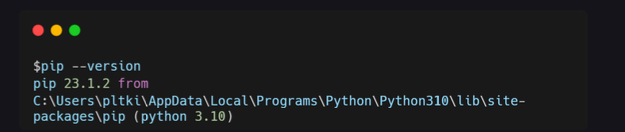
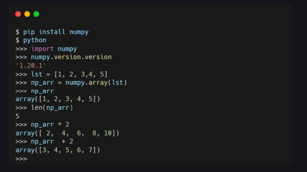
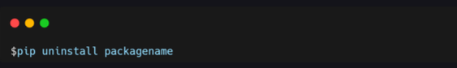
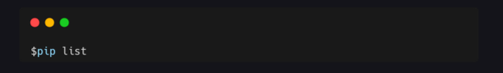
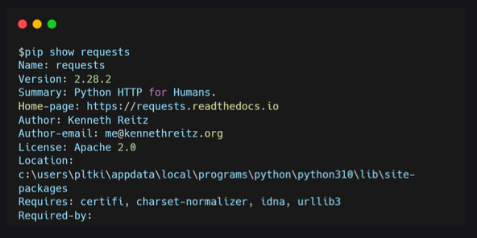
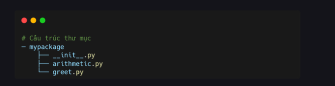
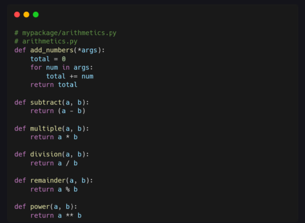
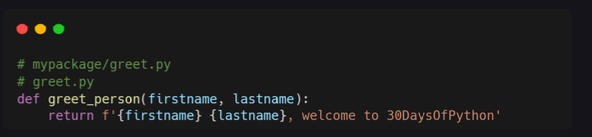
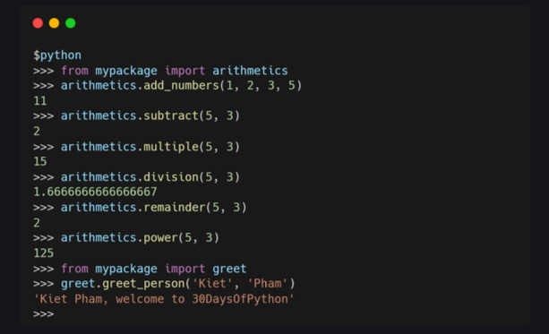

# Day20: PIP

### PIP

PIP là viết tắt của Preferred installer program. Chúng ta sử dụng pip để cài đặt các gói (package) Python khác nhau. Gói là một module Python có thể chứa một hoặc nhiều module hoặc các gói khác. Thay vì viết lại mọi thứ thì các bạn có thể sử dụng import các gói khác nhau để sử dụng. 

### Cài đặt PIP 

Để kiểm tra xem bạn đã cài pip hay chưa thì chỉ cần gõ lệnh **PIP --version**. Nếu bạn chưa cài pip thì có thể cài theo 2 cách dưới đây.
 - Windown: py get-pip.py
 - Linux: python get-pip.py
 - MacOSL python get-pip.py
 

### Cài đặt package 

Để cài đặt package, bạn chỉ cần gõ lệnh **pip íntall tên-package**. Mình sẽ cài đặt package numpy. Đây là một trong những package phổ biến nhất trong cộng đồng khoa học dữ liệu và máy học. 

### Gỡ cài đặt package 

Để gỡ cài đặt package, bạn có thể chạy lệnh **pip uninstall tên_package**. 

### Xem danh sách package 

Để xem danh sách packages trên máy tình của mình, các bạn chỉ cần gõ lệnh **pip list**. 

### Xem package 

Để xem thông tin về package, bạn có thể dùng lệnh ***pip show tên_package**. Nếu bạn muốn xem thêm thông tin chi tiết thì thêm --verbose. 

### Tạo package 

Một module có thể chứa nhiều đối tượng, chẳng hạn như class, hàm... Một package có thể chứa một hoặc nhiều module liên quan. Một package thực ra là một thư mục chứa một hoặc nhiều file module. 

Mình sẽ tạo 1 package để ví dụ. Đầu tiên mình tạo 1 thư mục có tên mypackage, rồi tạo file init.py trong thư mục đó. Sau đó tạo 2 module arithmetric.py và greet.py

### Tạo package 

Trong file arithmetric.py và greet.py sẽ có code như sau: 

Giờ mình sẽ thửu sử dụng gói package đã tạo. File init.py lưu trữ nội dung của package. Khi bạn đặt init.py trong thư mục package, pyhton sẽ nhận diện đây là package. 

### Bài tập 

1. Tạo package calculator với các chức năng sau: cộng, trừ, nhân, chia, mũ, căn bậc 2, luỹ thừa.

2. Tự tạo package tạo mật khẩu ngẫu nhiên có chữ thường, chữ hoa và số. Package này sẽ có 1 tham số là độ dài của mật khẩu.

3. Tạo packge sắp xếp list có tham số là cách cách sắp xếp. Ví
dụ 0 là từ lớn đề bé, 1 là từ bé đến lớn.

