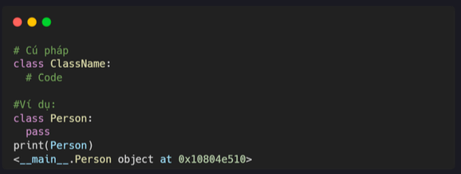
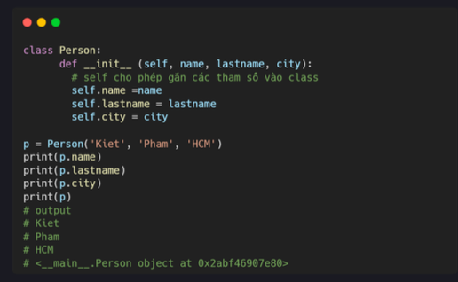
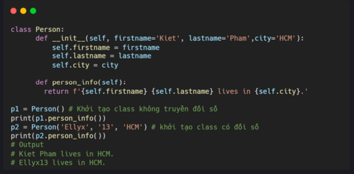
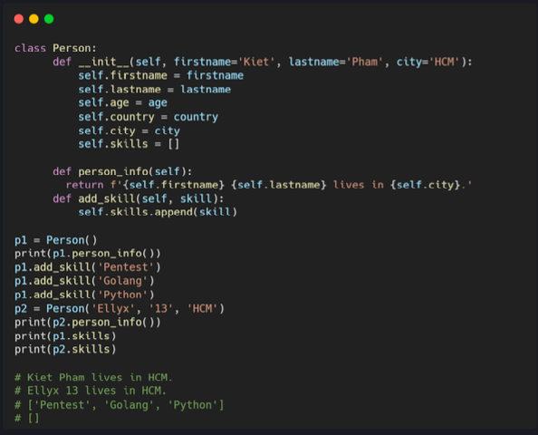
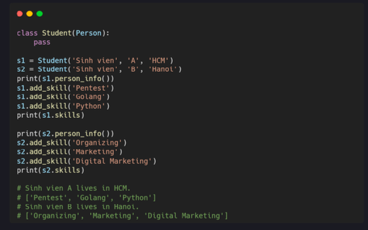
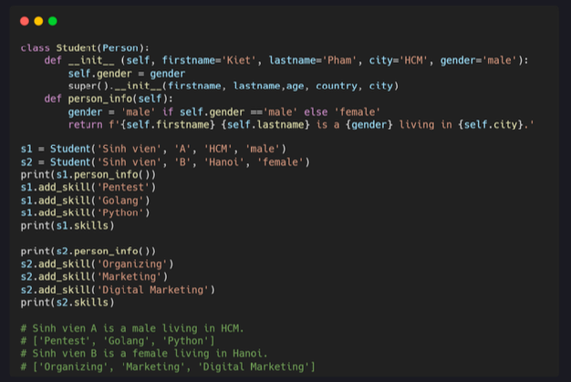

# Day 21: Class và Object 

### Class và object 
Python là một ngôn ngữ lập trình hướng đối tượng. Mọi thứ trong Python đều là **Object (đối tượng)**, gồm các thuộc tính và method. Chúng ta tạo Class để tạo một Object. Một Class giống như một hàm tạo Object hoặc bản thiết kế để tạo các Object. Class định nghĩa các thuộc tính và hành vi của Object. mặt khác, object cũng đại diện cho class. 

### Tạo Class

Đế tạo class, chúng ta cần từ khóa **class** theo sau là tên class và hai dấu chấm. Tên class phải tuân thủ theo **quy ước đặt tên CamelClass**. 

### Tạo object 

Chúng ta có thể tạo một object bằng cách gọi class. 

### Class Constructor 

Nhiệm vụ của hàm constructor là khởi tạo (gán các giá trị) cho các biến dữ liệu trong class khi một object của class được tạo ra. Trong Python, phương thức **__init()__** được gọi là hàm constructor và luôn được gọi khi một object được tạo ra. Hàm **__init()__** có tham số đầu tiên là **selff**, tham chiếu dến object hiện tại của class và được sử dụng để truy cập các biến thuộc về class đó. 

### Object method 

Các object cũng có các methods. Các method là **các chức năng của object.** 

### Method mằc định 

Ở một số trường hợp, bạn cần có gía trị mặc định cho các method của object. Nếu chúng ta gán các giá trị mặc định cho các tham số trong hàm constructor, chúng ta có thể tránh được các lỗi khi gọi hoặc khởi tạo class của mình mà không có đối số.

### Method thay đổi gái trị của Class 

Trong Class Person ở dưới, tất cả các tham số của hàm constructor dều có gía trị mặc định. Chúng ta có thể truy cập giá trị của class bằng method. Mình sẽ tạo method add_skill để thêm các ký năng vào list skills.

### Tính kế thừa 

Tính kế thừa vừa cho phép chúng ta định nghĩa một class mới kế thừa tắt cả các method và thuộc tính từ class cha. Class cha là class cung cấp tắt cá các phương thức và thuộc tính. Class con là class kế thừa từ class khác hoặc class cha. Mình sẽ tạo class Student bằng cách kế thừa class Person. 

### Ghi đè mrthod 

Chúng ta có thể sử dụng hàm super() hoặc tên class cha đẻ tự động kế thừa các method và thuộc tính từ class cha. Trong ví dụ dưới, mình ghi đè method của class cha. Methos của class con có một tính năng khác, nó có thể xác định giói tính của sinh viên. 

### Bài tập 

1. Tạo class Person có các thuộc tính như firstname, lastname. Class Person có method account_info() infirstname và lastname.

2. Tạo class PersonAccount kế thừa từ class Person. Nó có các thuộc tính như firstname, lastname, incomes,  expenses và nó có các method: total_income, total_expense, account_info, add_income, add_expense và account balance. Incomes là danh_sách thu thập. Expenses là danh sách chi phí phải trả.