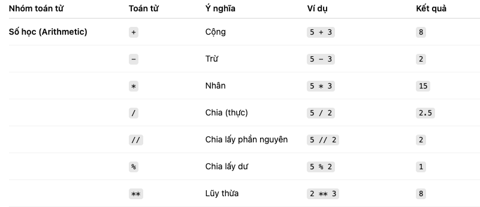

## Toán tử 
# Boolean 
Kiểu dữ liệu boolean chứa một trong hai gía trị **True** hoặc **False**. Kiểu dữ liệu này sẽ thường được sử dụng trong các điểu kiện so sánh. Chữ cái đầu tiên của True là T và False là F được **viết hoa**, không giống như JiavaScript. 

Ví dụ: 
print(True) 
print(False)

# Toán tử gán 
Toán tử gán được sử dụng để gán giá trị cho biến. Lấy dấu bằng "=" làm ví dụ. Dấu bằng trong toán học cho thấy rằng hai gía trị bằng nhau, tuy nhiên trong Python và một số ngôn ngữ lập trình khác nó có nghĩa là **lưu giá trị cho một biến** nhất định và chúng ta gọi nó là phép gán hoặc gán gía trị cho một biến. Bảng bên dưới là ví dụ cho các toán tử trong Python. 

# Toán tử số học 
- Phép cộng (+): a + b
- Phép trừ (-): a - b
- Phép nhân (*): a * b
- Phép chia (/): a / b
- Chia lấy dư (%): a % b
- Chia lấy nguyên (//): a // b
- Luỹ thừa (**): a ** b-

 
ví dụ: 
a = 3
b = 2

tong = a + b
hieu = a - b 
tich = a * b  
chia = a / b
chiaDu = a % b
chiaNguyen = a // b 
luyThua = a ** b 

 print (' a + b = ', tong )
 print ('a - b = ', hieu )
 print ('a * b = ', tich )
 print ('a / b = ', chia )
 print ('a % b = ', chiaDu )
 print ('a // b = ', chiaNguyen )
 print ('a ** b = ', luyThua )

# Toán tử so sánh

 Chúng ta so sánh các gái trị bằng cách sử dụng tón tử so sánh. Bạn có thể kiểm tra xem các giá trị này có lớn hơn hoặc nhỏ hơn hoặc bằng gía trị khác hay không.

ví dụ: 

print(3 > 2) # True
print (3 >= 2) # True
print (3 < 2) # False
print(2 < 3) # True
print (2<= 3) #True
print(3= 2) # False
print (3 1- 2) # True

print(len( 'mango') = len( 'avocado" )) #False
print(len( 'mango') |= len( 'avocado' ))# True
print (len( 'mango') < len( 'avocado' ))# True
print(len( 'milk' ) I= len('meat')) # False
print(len( 'milk') = len( 'meat' ))# True
print(len( 'tomato' ) = len( 'potato' ))# True
print(len( 'python') > len( 'dragon'))# False

# So sánh các giá trị Boolean
print ('True = True:, True = True)
print( True = False:True = False)
print( 'False = False:', False = False) #True #False

Ngoài ra các toán tử so sánh ở trên, Python còn sử dụng:
- is : Trả về True cả hai biến là cùng một gía trị (x is y)
- is not : Trả về True nếu cả hai biến không phải cùng một giá trị (x not y)
- in : Trả về True nếu danh sách được truy vấn chưa giá trị so sánh (x in y)
- not in : Trả về True nếu danh sách được truy vấn không có giá trị so sánh (x not in y)

print('1 is 1', 1 is 1) # True

print('1 is not 2', 1 is not 2)# True

print( 'K in Kiet', 'K' in 'Kiet') # False

print( 'B in Kiet', 'B' in 'Kiet') # True

print( 'coding' in 'coding for all') # True
 
print( 'a in an:', 'a' in 'an') # True

print('4 is 2 ** 2:', 4 is 2 ** 2) # True

