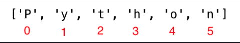
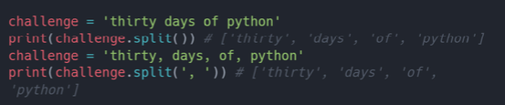

### Chuỗi 
 Văn bản là một kiểu dữ liệu chuỗi. Bất kỳ loại dữ liệu nào được viết dưới dạng văn bản đều là chuỗi. Python có các phương thức chuỗi khác nhau và các hàm có sẵn để xử lý các chuỗi. Để kiểm tra độ dài của chuỗi, bạn có thể dử dụng hàm **len()**.

 

 

 ## Nối chuỗi 
 Bạn có thể nối 2 hoặc nhiều chuỗi lại với nhau bằng cách dưới đây. Ngoài ra bạn có thể sử dụng **join()** thay vì + để việc nối chuỗi hiệu qủa hơn. 

 

 ## Escape sequence 

 Trong Python và các ngôn ngữ khác, cú pháp **\{ký tự}** là Escape sequenc. Các Escape sequenc phổ biên nhất 
 - \n: Tạo dòng mới 
 - \t: Thêm tab(8 dấu cách) 
 - \\: Dấu gạch chéo ngược
 - \': Dấu nháy đơn (') 
 - \": Dấu nháy kép 

 

 ## Định dạng chuỗi 

 Toán tử **"%"** được sử dụng để định dạng một tập hợp các biến được đặt trong một **"tuple"**. cùng với đối số là các ký hiệu đặc biệt như "%s", "%d", "%f", "%.nf":
 - **%s** - Chuỗi 
 - **%d** - Số nguyên 
 - **%f** - Số thực
 - **%.nf** - Số thực với độ chính xác n

**Định dạng chuỗi này được giứoi thiệu trong python python3**

## Nội suy chuỗi 

Một định dạng chuỗi mới khác là nội suy chuỗi, **F-string**. Các chuỗi bắt đầu bằng f và chúng ta có thể đưa dữ liệu vào các vị trí tương đương trong chuỗi.

## Chuỗi dưới dạng các ký tự 

Chuỗi Python là **Tập hợp các ký tự**. Cách đơn giản nhất đẻ trích xuất các ký tự đơn lẻ từ các chuỗi là gán chúng vào các biến tương ứng. 

## Truy cập ký tự thoe index

Trong lập trình thứ tự đếm **bắt đầu từ số 0** Do đó, chữ cái đầu tiên của chuỗi có index bằng 0 và chữ cái cuối cùng của chuỗi là độ dài của chuỗi trừ đi một. 

## Cắt chuỗi 

Trong Python, chúng ta có thể cắt các chuỗi thành các chuỗi con.

## Đảo ngược chuỗi 

Chúng ta có thể dễ dàng đảo ngược chuỗi trong Python bằng cách dưới. 

## Bỏ qua ký tự khi cắt chuỗi 

Bạn có thể bỏ qua các ký tự không mong muốn bằng cách thêm bước nhảy khi cắt chuỗi. 

## Phương thức 
**capitalize()**: Chuyển ký tự đầu tiên của chuỗi thành chữ in hoa.

**count()**: tar về số lần xuất hiện của chuỗi con trong chuỗi, đếm (chuỗi co, bắt đầu từ, kết thúc).  

**endwith**: Kiểm tra xem một chuỗi có kết thúc bằng một từ được chỉ định hay không. 

**expandtabs**: Thay thế ký tự tab bằng dấu cách, kích thước tab mặc định là 8. 

**find()**: Trả về index của lần xuất hiện đầu tiên của chuỗi con, nếu không tìm thấy trả về -1. 

**rfind()**: Trả về index của lần xuất hiện cuối cùng của chuỗi con, nếu không tìm thấy trả về -1. 

**index**: Trả về index thấp nhất của một chuỗi con,các tham số cho biết vị trí bắt đầu và kết thúc (mặc định là 0 và độ dài chuỗi -1). Nếu không tìm thấy chuỗi con, nó sẽ trả giá trị Error.

**rindex**: Trả về index cao nhất của một chuỗi con, các tham số bổ sung cho biết vị trí bắt đầu và kết thúc (mặc định 0 và độ dài chuỗi -1).

**isalnum**: Kiểm tả ký tự chữ và số.

**isalpha()** Kiểm tra xem tất cả các phần tử trong các chuỗi có phải là ký tự trong bảng chữ cái hay không (a-z và A-Z).

**isdigt()**: Kiểm tra tất cả các ký tự trong chuỗi có phải là số không (0-9 và một số ký tự unicode khác cho số). 

**isnumeric()**: Kiểm tra xem tất cả các ký tự trong chuỗi có phải là số hoặc liện quan đến số hay không (giống như insdigit(), nhưng chấp nhận nhiều dạng hơn, như 1/2)

**isdentifile()**: Kiểm tra xem một chuỗi có phải là một tên biến hợp lệ hay không. 

**islower()**: Kiểm tra xem tất cả xá ký tự trong chuỗi có phải là chữ thường hay không. 

**isupper()**: Kiểm tra xem tất cả các ký tự trong chuỗi có phải là chữ hoa hay không. 

**join()**: Nối các chuỗi lại với nhau. 

**strip()**: Xoá tất cả các ký tự được chỉ định trong đầu và cuối mỗi chữ. 

**replace()**: Thay thế chuỗi con bằng một chuỗi đã cho. 

**split()**: Tách chuỗi, sử dụng chuỗi hoặc khoảng trắng đã cho làm thư ký tự phân cách. 

**title()** Trả về tiêu đề chuỗi. 

**sawpcase()**: Chuyển đổi tất cả các ký tự hoa thành ký tự thường và tất cả ký tự thường thành ký tự hoa. 

**startedwith()**: Kiểm tra xem chuỗi có bắt đầu bằng chuỗi được chỉ định hay không. 

## Bài tập 

1. Nối chuỗi 'Ba muoi','ngay','hoc','Python' thành một chuỗi duy nhất,'Ba muoi ngay hoc Python'.
2. Thay đổi tất cả các ký tự thành chữ in hoa bằng phương thức upper().
3. Sử dụng các phương thức capitalize(), title(), swapcase() để định dạng giá trị của chuỗi Coding For All. Kiểm tra xem chuỗi Coding For All có chứa từ
4. Coding hay không bằng cách sử dụng phương thức index, find hoặc các phương thức khác.
5. Tách chuỗi 'capitalize(), title(), swapcase()' bằng cách sử dụng split().
6. "Facebook, Google, Microsoft, Apple, IBM, Oracle, Amazon" tách chuỗi trên bằng dấu phẩy.
7. In các dòng dưới bằng cách định dạng chuỗi.

