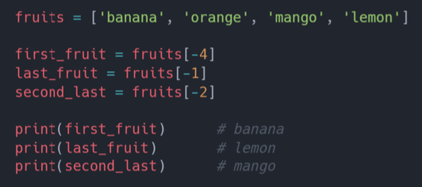
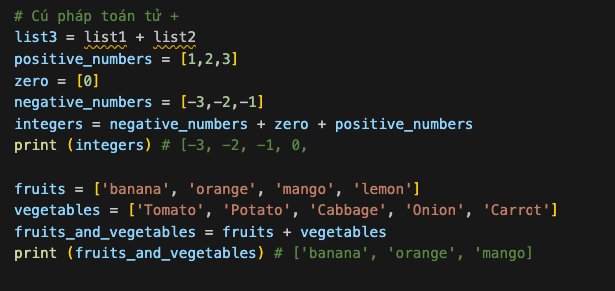

# List 

## List 

List là tập hợp các loại dữ liệu khác nhau có thể **sắp xếp và sửa đổi** các phần tử. Một lits có thể trống hoặc chứa các phần tử có các kiểu dữ liệu khác nhau. 

## Tạo lits 
Trong python, chúng ta cso tểh tạo lít theo hai cách: 
- Sử dụng Hàm tích hợp list()
- Sử dụng dấu ngoặc vuông []

## Truy cập lits 

Chúng ta có thể truy cập các phần tử trong lits bằng index. Index của lits sẽ bắt đầu từ 0. 

Bạn cũng có thể truy cập list từ dưới lên bằng index ngược. Ví dụ: -1 là phần tử cưới cùng, -2 là phần tử cuối cùng thứ 2. 

## Upacking List 

## Cắt phần tử 

Chúng ta có thể cắt các phần tử trong lits bằng cách chỉ định index bắt đầu, kết thúc và bước để tạo ra 1 list mới 

## Chỉnh sửa 

Do list là bộ dữ liệu có thể chỉnh sửa và sắp xếp nên bạn có thể làm những điều sau: 

## Kiểm tra 

Bạn có thể kiểm tra một phần tử có nằm trong list không bằng cách sử dụng toán tử **in**.

## Thêm phần tử 
Để thêm các phần tử vào cuối list, bạn có thể sử dụng hàm **append()**.

## Chèn phần tử 
Chúng ta có thể sử dụng hàm **insert()** để chèn phần tử vào một vị trí được chỉ định trong lits. Lưu ý: Các phần tử khác sẽ được chuyển sang bên phải. Hàm insẻt() nhận hai tham số: vị trí() và phần tử để chèn. 

## Xóa phần tử 

Hàm **remoev()** xóa phần tử được chỉ định khỏi list. 

## Xóa phần tử 
Hàm **pop()** xóa phần tử được chỉ định vị trí, các phần tử cuối cùng của lits nếu bạn không chỉ định vị trí muốn xóa. 

Từ khóa **del** xóa phần tử được chỉ định vị trí và nó cũng có thể được sử dụng để xóa các phần tử trong phạm vi index. Nó cũng có thể xóa hoàn toàn lits. 

## Làm trống list 

Hàm **clear()** dùng để làm trống list. 

## Sao chép list 

Bạn có thể sao chép list bằng cách gán lại cho nó một biến mới theo cách **list2 = list1**. Bây giờ, list2 là tham chiếu của list1, bất kỳ thay đổi nào của chúng ta thực hiện trong list2 thì lits1 cũng sẽ sửa đổi theo. 

Nhưng có nhiều trường hợp chúng ta không muốn sửa đổi list gốc thì sao. Một trong những cách để tránh vấn đề trên là dùng hàm **copy()**.

## Nối lits 
Có nhiều cách để nối hai hay nhiều list trong Python, nhưng mình sẽ giới thiệu cho các bạn hai cách là sử dụng **toán tử +** và hàm **extend()**.

## Đếm phần tử 

Hàm **count()** trả về số lần một phần tử xuất hiện trong danh sách: 

## Tìm phần tử 

Phương thức **index()** trả về vị trí của một phần tử trong list. 

## Đảo ngược list 
Hàm **reverse()** đảo ngược thứ tự của lits. 

## Săp xếp list 

Để sắp xếp list, chúng ta có thể sử dụng hàm **sort()** hoặc **sorted()**. Hàm sort() sắp xếp lại các phần tử trong list theo thứ tự tăng dần và **sửa đổi list ban đầu**. Nếu tham số reverse của sort() bằng true, nó sắp xếp lits theo thứ tự giảm dần. 

## Sắp xếp list 

Hàm **sort()** trả về lits đã sắp xếp mà không sửa đổi list ban đầu . Ví dụ: 

## Bài tập 

Level 1
1. Khai báo list có tên it_companies và gán các giá trị ban đầu Facebook, Google, Microsoft, Apple, IBM, Oracle và Amazon.

2. In số lượng công ty trong danh sách

3. In công ty đầu tiên, giữa và cuối cùng

4. In danh sách sau khi sửa đổi một trong các công ty

5. Thêm công ty CNTT vào it_companies

6. Chèn một công ty CNTT vào giữa danh sách công ty

7. Nối it_companies với chuỗi '#; '

8. Kiểm tra xem một công ty nào đó có tồn tại
trong list it_companies hay không.

9. Sắp xếp list bằng phương thức sort()

10. Đảo ngược list theo thứ tự giảm dần bằng hàm reverse()

11. Xoá 3 phần tử đầu của list

12. Xoá toàn bộ list

Level 2
1. Danh sách tuổi 10 học sinh: ages = [19, 22, 19,
24, 20, 25, 26, 24, 25, 24]

2. Sắp xếp danh sách và tìm tuổi nhỏ nhất và lớn
nhất

3. Thêm lại tuổi nhỏ nhất và lớn nhất vào danh
sách

4. Tìm độ tuổi trung bình (phần tử ở giữa hoặc hai
phần tử ở giữa chia đôi)

5. Tìm độ tuổi trung bình (tổng của 
tất cả các phần tử chia cho tổng số phần tử)

6. Tìm phạm vi độ tuổi (lớn nhât trừ nhỏ nhất)

7. So sánh giá trị của (tối thiểu - trung bình) và (tối đa - trung bình), sử dụng phương thức a ()

8. Sắp xếp danh sách và unpacking các phần tử vào các biến nhoHon23, lonHon23.

