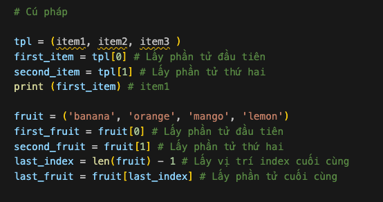

# Tuple 

# Tuple 
Tupe là tập hợp các kiểu dữ liệu khác nhau được sắp xếp theo thứ tự và **không thể thay đổi (immutable)**. Do không thể thay đổi giá trị của tuple cũng không thể sử dụng các phương thức add, insert, remove. Không giống như list, tuple có ít phương thức hơn. 

# Tạo tuple 

Trong Python, có 2 cách để tạo tuple là tpule rỗng và tpule được gán giá trị ban đầu. 

# Truy cập tuple 

Tương tư như list, chứng ta có thể truy cập các phần tử trong tuple bằng index. Index của tuple sẽ bắt đàu từ 0. 

# Cắt phần tử