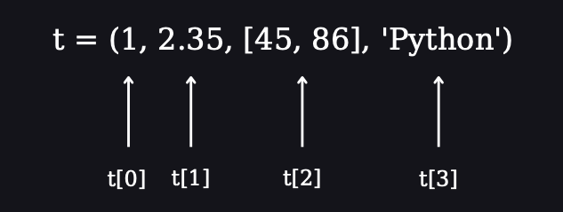
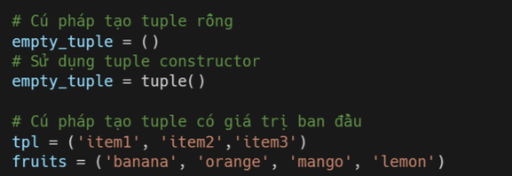
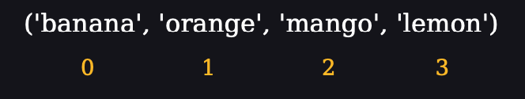
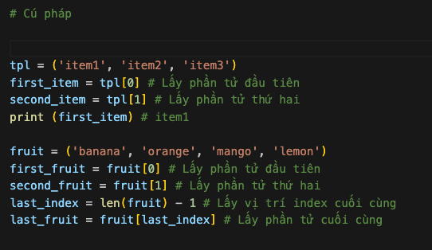
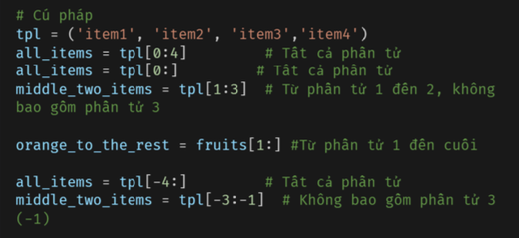
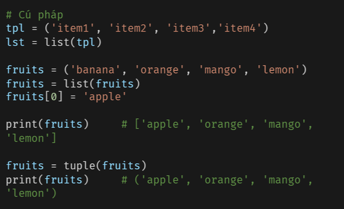
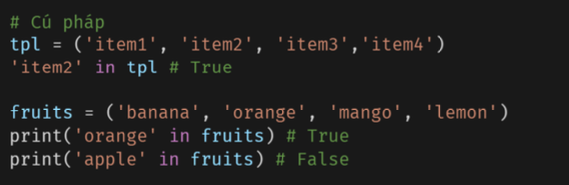
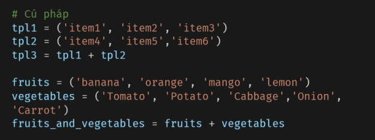
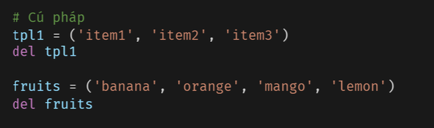

# Tuple 

## Tuple 
Tupe là tập hợp các kiểu dữ liệu khác nhau được sắp xếp theo thứ tự và **không thể thay đổi (immutable)**. Do không thể thay đổi giá trị của tuple cũng không thể sử dụng các phương thức add, insert, remove. Không giống như list, tuple có ít phương thức hơn. 

## Tạo tuple 

Trong Python, có 2 cách để tạo tuple là tpule rỗng và tpule được gán giá trị ban đầu. 

## Truy cập tuple 

Tương tư như list, chứng ta có thể truy cập các phần tử trong tuple bằng index. Index của tuple sẽ bắt đàu từ 0. 

## Cắt phần tử
Chúng ta có thể cắt các phần tử trong tuple bằng cách chỉ định index bắt đầu, kết thúc để tạo ra 1 list mới 

## Chuyển tuple thành list 

Chúng ta có thể chuyển tuple thành list và ngược lại. Tuple là bất biến nấu bạn muốn sửa đổi một tuple, thì bạn cần chuyển nó thành list trước. 

## Kiểm tra 

Bạn có thể kiểm tra phần tử có tồn tại trong tuple hay không bằng cách sử dụng **in()**, nó sẽ trả về cặp giá trị **boolean**. 

## Kết hợp tuple 

Bạn có thể kết hợp hai hoặc nhiều tuple bằng **toán tử +**.

## Xóa tuple 

Bạn không thể xóa một phần tử trong tuple nhưng có thể xóa tuple bằng cách sử dụng **del**. 

## Bài tập 

Level 1
1. Tạo tuple trống

2. Tạo tuple chứa tên của anh chị em của bạn

3. Nối tuple anh chị em và tuple cô dì chú bác

4. Đếm tuple anh chị em?

5. Sửa đổi tuple anh chị em và thêm tên cha mẹ của bạn và nối vào tuple family_members

Level 2
1. Unpack anh chị em và cha mẹ khỏi family_members

2. Tạo tuple trái cây, rau và sản phẩm của động vật.

3. Kết hợp 3 tuple đó và gán nó cho một tuple gọi là food_stuff_tp.

4. Chuyển tuple food_stuff_tp thành lits food_stuff_lt

5. Cắt bỏ phần tử ở giữa, ba mục đầu tiên và ba mục cuối cùng khỏi danh sách food_stuff_lt

6. Xóa hoàn toàn tuple food_stuff_tp

7. Kiểm tra xem 'Viet Nam' có tồn tại trong tuple
countries = ('Denmark','Finland','Viet Nam','Norway','Sweden') không?