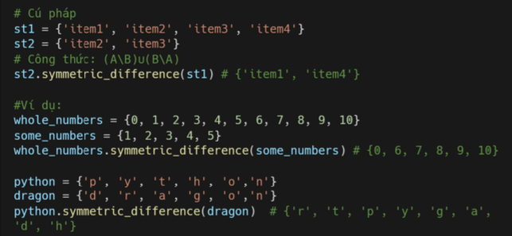

# Set 
## Set 
Set là tập hợp các phần tử riêng biệt **không có thứ tự** và ***không được lập chỉ mục**(index). Trong python, set được sử dụng để lưu trữ các phần tử duy nhất và tính toán các phép hợp, giao, hiệu. lấy phần bù, tìm tập hợp con, tập hợp khác biệt,...

## Tạo set 
Bạn có thể sử dụng dấu ngoặc nhọn {} để tạo set hoặc hàm tích hợp sẵn **set()**

## Độ dài set 
Bạn có thể sử dụng hàm **len()** để tìm độ dài của một set. 

## Truy cập set 

Do set không được lập chỉ mục (index) nên bạn phải sử dụng **vòng lặp** để truy cập các phần tử có trong set. Mình sẽ nói rõ hơn trong bài vòng lặp. 

## Kiểm tra phần tử 

Để kiểm tra một phần tử có tồn tại trong set hay không, bạn có thể sử dụng toán tử **in**. 

## Thêm phần tử 

Sau khi một set được tạo, chúng ta không thể thay đổi bất kỳ phần tử nào nhưng bạn vẫn có thể thêm các phần tử mới bằng phương thức **add()** hoặc **update()**. 

## làm sạch set 

Nếu bạn muốn xóa hoặc làm trống set, bạn có thể sử dụng phương thức **clear()**

## Xóa set 

Nếu bạn muốn xóa chính set đó, bạn có thể sử dụng toán tử **del**. 

## Kết hợp set 

Bạn có thể nối hai set bằng phương thức **union()** hoặc **update()**. 

## Phép giao 

Tích hợp các phần tử **xuất hiện trong cả 2 set** được gọi là 1 set giao nhau. 

## Kiểm tra set con 

Một tập hợp (set) có thể là tập hợp con hoặc tập hợp cha của các tập hợp khác. 

## Phép hiệu 

Phương thức difference() sẽ trả về 1 set mới **chứa các phần tử khác nhau của 2 set**. 

## Phép đối xứng 

Phép đối xứng sẽ trả về một tập hợp chứa tất cả các phần tử từ cả hai tập hợp, ngoại trừ các phần tử có mặt trong hai tập hợp, công thức toán học: **(A\B) U (B\A)**.

## 2 set rời rạc 

Nếu hai tập hợp không có phần tử chung, thì đó là các tập hợp rời rạc. Chúng ta có thể kiểm tra xem hai tập hợp có rời rạc hay không bằng cách sử dụng phương thức **isdisjoint()**

 
## Bài Tập 
Level 1
1. Tìm độ dài của tập hợp it_companies

2. Thêm 'Twitter' vào it_companies

3. Chèn nhiều công ty CNTT cùng lúc vào tập hợp it_companies

4. Xóa một công ty khỏi set it_companies

5. Sự khác biệt giữa remove và discard

Level 2
1. Kết hợp hai tập hợp A và B

2. Tìm A giao điểm B

3. Kiểm tra tập con của B

4. Tập hợp A và B có rời rạc không

5. Nối A với B và B với A

6. Tập hợp đối xứng giữa A và B

7. Xóa hoàn toàn các tập hợp
