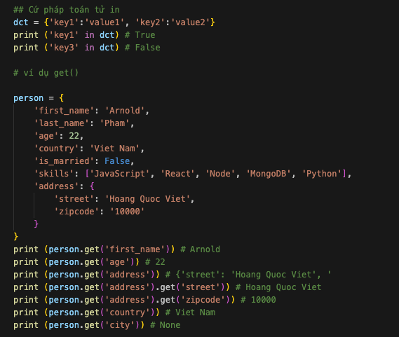
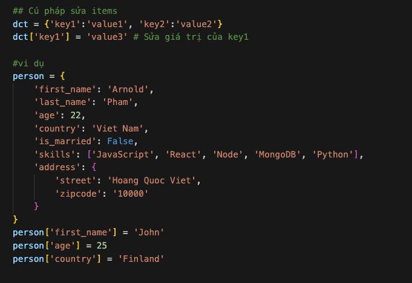
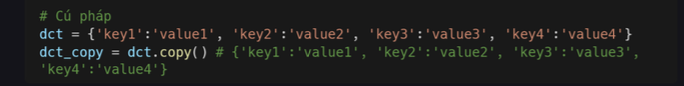

# Dictionary 

## Dictionary 

Dicionary là một tập hợp các dữ liệu chứa cặp giá trị key và các value, không có thứ tự và có thể thay đổi được. 

## Tạo dict 

Để tạo dict, bạn có thể sử dụng dấu ngoặc nhọn **{}** hoặc hàm **dic()**. Ngoài ra, giá trị của các dict có thể là bất kỳ kiểu dữ liệu nào. 

## Truy cập dict 
Bạn có thể truy cập dict bằng tên dict và key trong dict 

## Độ dài dict 

Hàm **len()** sẽ kiểm tra số cặp key-value trong dict 

## Kiểm tra Key 

Truy cập key không tồn tại sẽ gây ra lỗi. Để tránh lỗi này, chúng ta phải kiểm tra xem key có tồn tại hay không bằng phương thức **get()**. Phương thức get sẽ trả về None nếu key không tồn tại. Ngoài ra, bạn cững có thể sử dụng toán tử **in**. 

## Thêm items

Chúng ta có thể thêm phần tử (item) vào dict bằng cách sau: 

## Xóa items
Bạn có thể xóa key và value trong dict bằng cách sau: 
- **pop(key)**: xóa items có key được chỉ định 
- **popitem()**: xóa items cuối cùng 
- **del**: xóa dict được chỉ định 

## Chuyển dict sang lits 

Phương thúc **item()** sẽ chueyenr dict thành lits chứa các cặp key và value. 

## Xóa dict 
Nếu bạn không muốn sử dụng dict nữa thì có thể xóa nó hoàn toàn bằng **del**. 

## Sao chép dict 

Bạn có thể sao chép dict bằng phương thức **copy()**. Nó sẽ tạo ra một bản sao để tránh làm thay đổi dict gốc. 

## Xem key 

Phương thức **keys()** cung cấp cho chúng ta tắt cả các key của dict dưới dạng lits. 

## Xem value 

Phương thức **value()** cung cấp cho chúng ta tất cả các value của dict dưới dạng lits. 

## Bài tập 

1. Tạo một dict trống có tên là dog

2. Thêm tên, màu, giống chó, tuổi vào dog

3. Tạo dict student và thêm first_name, last_name, giới tính, tuổi, kỹ năng, quốc gia, thành phố và địa chỉ

4. Lấy độ dài của dict student

5. Lấy value của kỹ năng và kiểm tra kiểu dữ liệu, nó phải là list đấy nhé

6. Sửa đổi các giá trị của kỹ năng bằng cách thêm một hoặc hai kỹ năng khác

7. Lấy các key của dict dưới dạng list

8. Lấy các value của dict dưới dạng list

9. Thay đổi dict thành list bằng phương thức items()

10. Xóa một trong các items trong dict

11. Xóa một trong các dict đã tạo
