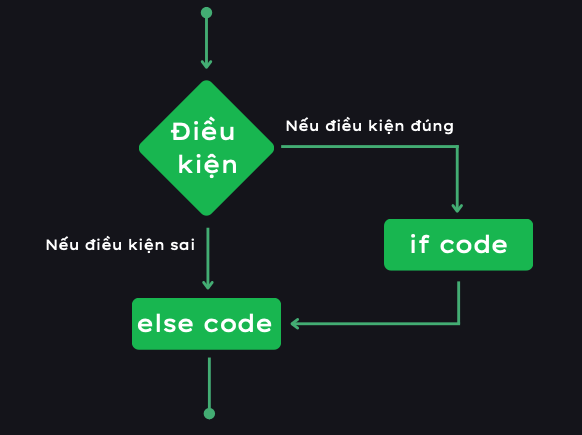
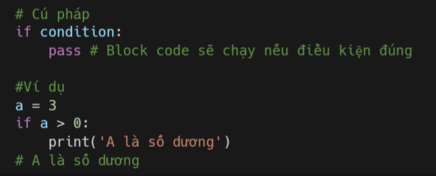
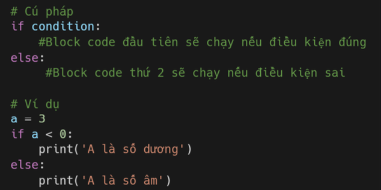
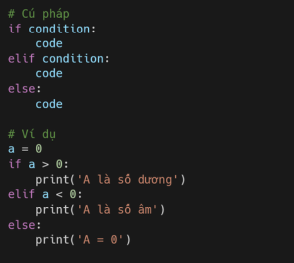
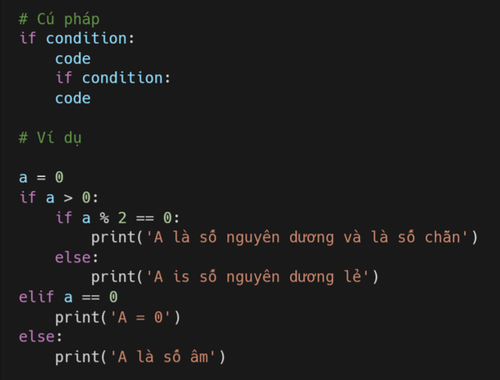
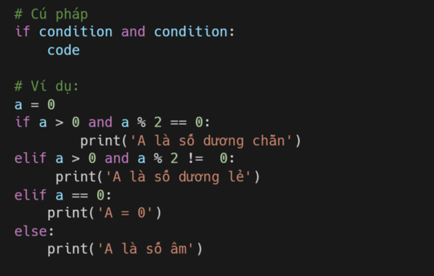
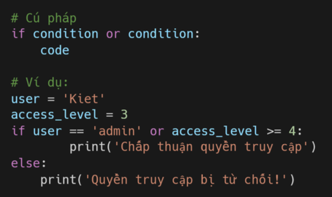

# IF
Theo mặc định, các câu lệnh trong Python **được thực thi từ trên xuống dưới**. Nhưng luồng thực thi cũng có thể được thay đổi bằng hai cách: 
- Sử dụng điều kiện: Một block gồm một hoặc nhiều câu lệnh sẽ được thực thi nếu một điều kiện nào đó đúng 
- Sử dụng vòng lặp: Một block sẽ được thực thi lặp đi lặp lại miễn là điều kiện còn đúng 

Trong bài học này, chúng ta sẽ tìm hiểu các câu lệnh **if, else, elif**. Các bạn sẽ được sử dụng các toán tử so sánh lgic mà chúng ta đã học ở bài trước. 

Trong python và các ngôn ngữ lập trình khác, từ khóa **if** được sử dụng để kiểm tra xem một điều kiện có đúng hay không để thực thi block code. Bạn cần lùi (thụt) đầu dòng sau dấu hai chấm ":" để viết block code. 

### If else 

Nếu điều kiện đúng thì block code đầu tiên sẽ được thực thi, còn nếu không thì block code thứ hai sẽ chạy. 

### Elif

Nếu bạn có nhiều điều kiện khác nhau thì có thể sử dụng Elif thay vì lồng nhiều If else vào nhau. 

### if lồng nhau 

Bạn có thể đặt các lệnh điều kiện if lồng vào nhau. Bạn nên tránh sử dụng if lồng nhau bằng toán tử **and**. 

### if và and 

Toán tử and trong if dùng để **kiểm tra nhiều điều kiện khác nhau**. Nếu tất cả điều kiện đó đúng thì thực hiện block code. 

### if và or

Toán tử or cũng kiểm tra nhiều điều kiện, nhưng chỉ cần một trong nhũng điều kiện này đúng thì cả câu if đó cũng đúng. 

## Bài tập 

Level 1
1. Nhận đầu vào của người dùng bằng cách sử dụng input("Nhập tuổi của bạn: "). Nếu người dùng từ 18 tuổi trở lên, thì trả lời: Bạn đủ tuổi lái xe. Nếu dưới 18 thì cho biết còn bao nhiêu năm nữa mới đủ tuổi.

2. Cho người dùng nhập tuổi của họ và so sánh tuổi của bạn. Nếu tuổi bạn lớn hơn thì in ra bạn lớn hơn bao nhiêu tuổi và ngược lại.

3. Cho người dùng nhập a và b. Nếu a lớn hơn b in "a lớn hơn b" , nếu a nhỏ hơn b thì in "a nhỏ hơn b".

Level 2
1. Cho học sinh nhập điểm và in điểm chữ. Ví dụ: 80-100= A, 70-89=B, 60-69=C, 50-59=D, 0-49=F.

2. Nhập tháng trong năm và cho biết tháng đó là mùa nào. Ví dụ Tháng 1-3 là mùa xuân, 4-6 là hạ, 7-9 là thu, 10-12 là đông.

3. Danh sách các loại trái cây gồm: fruits = ['banana','orange''mango','lemon']. Cho người dùng nhập trái cây, nếu không có trong list thì thêm vào, còn có rồi thì in "Trái cây đó đã có trong list".